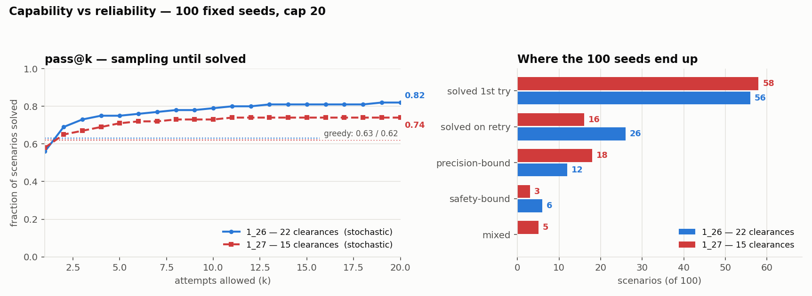
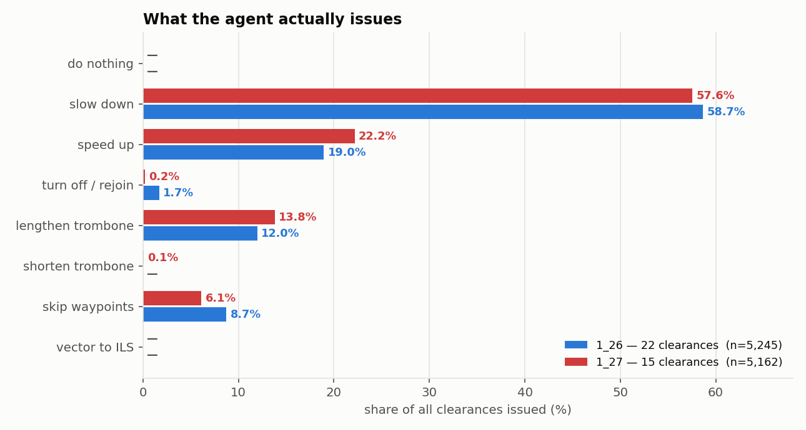

# Test log

!!! abstract "TL;DR"
    Every test run against a trained agent, in the order it happened, with the question it was
    asked to settle. Terms are defined once on [How an agent is tested](analysis_methods.md) —
    this page assumes them.

    Read it as the audit trail behind the [experiment log](experiments.md). The experiment log
    says *what we changed*; this says *what we checked, and what it turned out to be*. Several
    entries overturned something the team believed.

Source: `analysis/` (scripts and dated output directories), `experiments/<run>/progress_scored.csv`.

---

## 3 Aug — Is the reported success rate measuring anything? { #t-eval-noise }

**Agent under test:** `atc_run_1_22`, the best run of its era. · **Instrument:** re-scoring +
audit of the eval loop.

**Question.** `atc_run_1_22` reported a peak `eval_custom/success_rate` of **1.00**. Training
appeared to oscillate wildly between 0.0 and 1.0 rather than converge. Was that policy
instability?

**Method.** Read the eval loop, then re-score the saved checkpoint offline on a fixed pool.

**Result — the meter was broken, not the policy.** Three compounding defects: `n_eval_episodes`
was **5** (so `success_rate` can only take six values, SE ≈ 0.22 at p ≈ 0.4);
`_eval_episode_index` is never reset per pass, so **consecutive eval points measure completely
different scenarios**; and `best_model.zip` is the argmax over ~1600 such draws. Three
independent estimates put `1_22`'s true rate near **0.42** — the last-15% mean of eval passes
(0.41), a fresh 20-seed deterministic eval (0.50), and the frequency of 5/5 passes (implies
p ≈ 0.44). Deterministic scoring on the full 100-seed pool later returned **0.38**.

**Consequence.** Every cross-run claim resting on in-training `success_rate` was withdrawn.
`analysis/score_checkpoints.py` was written the same week, and is now the only sanctioned
instrument. A second finding fell out: **46.6%** of `1_22`'s eval passes scored exactly 0.0,
where a constant p = 0.44 predicts 5.5% — the policy reliably solves some seeds and never
solves others, so a scalar success rate was the wrong instrument regardless of its variance.

---

## 3 Aug — Was the success gate hiding real conflicts? { #t-gate-replay }

**Agent under test:** `atc_run_1_22` checkpoints, replayed. · **Instrument:** both success gates
instrumented simultaneously.

**Question.** Tiers were gated on *no near-conflict predicted by the NOOP rollout for the final
3 steps*. The team's hypothesis was that this forecast-based gate was too strict and was
suppressing success. Switching it to a realised-only test would therefore be a relaxation.

**Method.** Replay `1_22`'s own checkpoints with both the predicted gate and the realised gate
logged on every episode.

**Result — the hypothesis was wrong, in an informative way.** The predicted gate was **open in
every episode at every checkpoint: 0 relaxations in 95 episode-evaluations.** It had never once
bound. `SUCCESS_NEAR_CONFLICT_CLEAR_STEPS = 3` is only a ~135 s window at the very end of an
episode, and by then everything has landed.

**But the realised gate then showed that `no_near_conflicts_mean` is 0.774, not 0.996** — about
**23% of episodes contain a real loss of separation**, where the old metric had reported
"no near conflicts" 99.6% of the time. The conflict side of the problem was never as clean as
every run log since `1_17` had claimed. See [Loss of separation](separation.md).

---

## 4 Aug — Did the gate change cost any capability? (`1_22` vs `1_25`) { #t-1_22-vs-1_25 }

**Agents:** `atc_run_1_22` and `atc_run_1_25_trombone_relaxed` — byte-identical code except the
realised-only gate. · **Instrument:** deterministic scoring, 100 seeds.
· **Data:** `analysis/2026-08-04_1_22_vs_1_25.csv`.

| | success | separation | clean-subset | tier | max dev |
|---|---|---|---|---|---|
| `1_22` | 0.38 | 0.17 | 0.458 | 3.25 | 179.4 s |
| `1_25` | 0.44 | 0.18 | 0.537 | 3.20 | 192.4 s |

**Result.** The differences are inside the noise band (SE ≈ 0.05 each, so ≈ 0.14 is the
threshold for a claim). The gate change was a **semantics fix, not a capability change** —
exactly as predicted — and reported success became honest rather than smaller.

**Consequence.** This pair established the **clean-subset ceiling near 0.5** that the next three
runs were aimed at.

---

## 10 Aug — Are the observation features saturated? { #t-obs-norms }

**Agent under test:** the observation encoder, both scenarios. · **Instrument:**
`analysis/obs_norm_audit.py` — fraction of samples pinned at ±1, per feature. A pinned feature
carries no gradient, which is the same as not having the feature.

| feature | MXP before | MXP after | PMS before | PMS after |
|---|---|---|---|---|
| `time_to_target` | 65.6% | **18.1%** | 71.4% | **15.1%** |
| `time_deviation` | 3.2% | **0.0%** | 0.8% | **0.0%** |
| `time_deviation` span (of 2.0) | 1.13 | **1.32** | 1.12 | **1.38** |

**Result.** Two-thirds of aircraft had `time_to_target` pinned at its ceiling — constant for
most of the fleet for most of every episode. The linear `clip(d / 900)` deviation encoding put
**every tier boundary the agent is graded on (±60, 70, 100, 120 s) inside the bottom 13% of the
feature's range**, and encoded a 10 s error as **0.011** — indistinguishable from zero after
LayerNorm. The policy was being asked to hit ±60 s through a feature that barely moved there.

**Consequence.** The signed-log encoding shipped in run `1_26`, and is the change most likely
responsible for that run's collapse in worst-aircraft deviation.

---

## 10 Aug — Is the initial-conflict scenario filter doing anything? { #t-scenario-filter }

**Instrument:** `analysis/scenario_filter_probe.py`.

**Result — dead code.** `Simulator.check_not_imminent_infringement()` rejects candidate
scenarios on `severity >= 1.0`. Under the pre-`1_26` ramp, `severity == 1.0` required *literally
zero* separation, so the test never fired and the function **always returned `True`**. The
"initial-conflict-free scenario" filter had been inert since the conflict radius changed to 0.0.

**Consequence.** Not fixed at the time — repairing it would have shifted the training scenario
distribution mid-comparison. The `1_26` severity redesign makes `severity == 1.0` mean an actual
loss of separation, so the filter is live again by side effect.

---

## 10 Aug — Does `1_25`'s policy survive the new severity geometry? { #t-cross-mdp }

**Agent under test:** `atc_run_1_25`'s best checkpoint, scored **under `1_26`'s MDP**.
· **Data:** `analysis/2026-08-10_1_25_under_1_26_mdp.csv`.

| | success | separation | clean-subset | tier | max dev |
|---|---|---|---|---|---|
| `1_25` under its own MDP | 0.44 | 0.18 | 0.537 | 3.20 | 192 s |
| `1_25` under `1_26`'s MDP | **0.11** | **0.22** | **0.141** | 1.63 | 314 s |

**Result.** The old policy collapses under the new rules. **This is the control that makes
`1_26`'s numbers meaningful** — it rules out the possibility that `1_26` merely looked better
because the new MDP is easier to score well on. It is not: the same policy scores far worse
under it.

---

## 11 Aug — Does aircraft slot ordering change the decision? { #t-ordering }

**Agent under test:** `atc_run_1_26`. · **Instrument:** `analysis/ordering_sensitivity.py`,
25 scenarios × 8 orderings, scenario and observation frame held fixed, only `env.acft_perm`
re-rolled. · **Data:** `analysis/2026-08-11_1_26_ordering/`.

**Question.** Aircraft are assigned to observation slots in arrival order; the random
permutation in `reset()` is commented out and has never been used. Is arrival-order slotting
biasing results, and would shuffling be free data augmentation?

**Result — provably inert.** First-action agreement **100%** (the policy picks the same
*callsign* first regardless of which slot it occupies), **0 of 25** scenarios changed outcome,
deviation spread **0.0 s on every seed**, and every outcome field byte-identical across all
eight orderings.

**Why.** The policy's context is `concat(masked-mean over aircraft, global embedding)` — which
is permutation *invariant* — and the heads are applied slotwise with shared weights, so their
outputs are permutation *equivariant*. The test confirms the architecture end to end.

**Consequence.** Arrival-order slotting has never biased a result, and enabling the shuffle as
augmentation would buy nothing. One less hypothesis in the pool.

---

## 11 Aug — Capability or reliability? (`1_26`, 100 seeds) { #t-attempts-1_26 }

**Agent under test:** `atc_run_1_26` `best_model`. · **Instrument:**
[attempts-to-solution](analysis_methods.md#attempts), 100 seeds, cap 20.
· **Data:** `analysis/2026-08-11_1_26_attempts_100seeds/`.

Two smaller probes preceded it and are worth flagging as a lesson in sample size: a 25-seed run
at cap 10 gave deterministic 0.56 / pass@10 0.80, and a second 25-seed run at cap 100 gave
deterministic **0.80** / pass@100 0.92. That 25-seed subset is **markedly easier than the full
pool** — the 100-seed run below returns 0.63 deterministic. The small probes are not comparable
to it and should not be quoted.

| | value |
|---|---|
| deterministic | **0.63** |
| pass@1 (single-shot, stochastic) | **0.56** |
| pass@5 | 0.75 |
| pass@10 | 0.79 |
| pass@20 | **0.82** |
| never solved in 20 | **18** |

Attempts-to-first-success among the 82 solved: `1×56, 2×13, 3×4, 4×2, 6×1, 7×1, 8×1, 10×1,
11×1, 13×1, 19×1`.

**Result.** The pass@1 → pass@20 gap is **0.26 of pure reliability** — solving rollouts that are
already inside the policy's distribution, just not on the greedy path. That is recoverable at
inference by best-of-n or a shield, with no retraining at all.

**The 18 residual failures split cleanly** (rule in
[methods](analysis_methods.md#residual-split)):

| class | n | seeds |
|---|---|---|
| **precision-bound** | **12** | `1566942273`, `202363285`, `786551703`, `27911967`, `1477278577`, `1973214822`, `825873196`, `1392783743`, `240251661`, `284277889`, `2144181937`, `594130308` |
| **safety-bound** | **6** | `946785248`, `398340369`, `1259191105`, `1632629719` (bust 100% of attempts), `1242911821` (95%), `41` (70%) |

Every precision-bound seed tops out at **tier 4** with a best clean worst-aircraft deviation of
60–114 s — they need to shave one aircraft under the ±60 s bar and cannot. All of them end
**late**.

**Consequence — this is the test that designed clearance set v2.** Speed authority is roughly
19× weaker upward than downward (six consecutive `SPEED_UP_LARGE` move landing time −18 s
against +339 s for six `SLOW_DOWN_LARGE`), and on these twelve seeds the agent **lengthens the
trombone in 12 of 12 episodes at ~5× the pool-average rate** — adding delay it had no action to
take back. `SHORTEN_TROMBONE` exists because of this table. It also **de-prioritised the
multi-select action head**: 12 of 18 residual failures never lose separation, so coordination is
not their problem.

---

## 11 Aug — What does `1_26` do when allowed to retry? { #t-try25-1_26 }

**Agent under test:** `atc_run_1_26` @ 9.95M. · **Instrument:**
[stochastic benchmark with a clearance log](analysis_methods.md#solutions), 100 seeds, cap 25.
· **Data:** `atc_run_1_26_sep3nm_ppo_tada_9950000_steps_stoch_noshield_ep100_try25_results.md`.

**Result.** 83/100 solved within 25 attempts. Tier histogram `t0=4, t4=13, t5=83`, mean tier
4.67. Worst-aircraft deviation mean 41 s, median 34 s. Minimum separation mean 5.84 NM, median
5.42 NM, **min 0.14 NM**. Clearances per episode mean 52.5.

**The clearance mix is the load-bearing result** — it is what justified each cut in v2:

- `SLOW_DOWN_SMALL` 1995, `SLOW_DOWN_LARGE` 1082, `SPEED_UP_SMALL` 770 — speed control is the
  overwhelming majority of what the agent issues.
- `SPEED_UP_LARGE` 224, against `SLOW_DOWN_LARGE`'s 1082 — and it barely moves landing time.
- Every one of the **eight** v1 turn variants beyond the plain 10 NM rejoin appears in single or
  low double digits (`TURN_RIGHT_SKIP_1_..._5` = 39 is the largest; `TURN_LEFT_SKIP_1_..._10`
  = 1 the smallest).
- Everything v2 drops totals **7.16%** of all clearances issued.

---

## 11 Aug — Does the stack work under both clearance sets? { #t-selftest }

**Instrument:** `analysis/action_set_selftest.py`, run under `v1` and `v2`.

Checks enum size against `Config.NUM_ACTIONS`, contiguous ids from 0, a reward multiplier for
every clearance, `STORE_MUTATING_CLEARANCES` non-empty and in range, action-space shape,
action-history one-hot width, a read-only peek over every legal clearance asserting route length
is unchanged, and a 25-step masked random rollout. **All nine checks pass under both sets.**

This is the guard that catches a mis-set `TADA_ACTION_SET` before it silently poisons a
comparison, and it is re-run before every cross-set claim on this site.

**Related, found while building it:** the trombone inverse was verified directly — three
lengthens followed by three shortens restore the exact original route on 4/4 aircraft, and 30
randomly interleaved operations leave route length and store capacity identical to the start.

---

## 17 Aug — Does the reduced clearance set beat the full one? (`1_27` vs `1_26`) { #t-1_27-bands }

**Agents under test:** `atc_run_1_26_sep3nm` (22 clearances) and `atc_run_1_27_actionset_v2`
(15 clearances), both complete at 10M steps. · **Instrument:** deterministic scoring, every
million-step band plus a matched pair at 10M.
· **Data:** both runs' `progress_scored.csv`, `analysis/2026-08-17_1_2{6,7}_at10M_perseed.csv`.

**Question.** `1_27` finished on 12 Aug and had never been scored past 4M steps. Its only
post-4M signal was the in-training eval loop — the instrument [this log's first
entry](#t-eval-noise) disqualified. Does the reduced set actually help?

**Method.** Backfill the 5M–10M bands with `track_run.py`, then independently re-score both
runs' 10M checkpoints back-to-back on the same 100 seeds, as a replication.

| at 10M steps | success | 95% CI | separation | clean-subset | tier | worst-ac dev |
|---|---|---|---|---|---|---|
| `1_26` — 22 clearances | **0.70** | 0.60–0.78 | 0.07 | **0.753** | 4.38 | **43.4 s** |
| `1_27` — 15 clearances | **0.64** | 0.54–0.73 | 0.10 | **0.711** | 4.01 | **87.3 s** |

**Result — it learns faster and converges worse.** `1_27` leads on success at *every* checkpoint
through 7M (at 2M it is at 0.25 where `1_26` is at exactly 0.00), they draw level at 8M, and then
`1_26` pulls away. Worst-aircraft deviation tells the sharper story: `1_26` walks down 72 → 43 s
over its last 6M steps and crosses the ±60 s bar T5 requires; `1_27` never gets below 87 s.

On **success** the two are a statistical tie — 0.06 apart against a ≈0.13 threshold. On
**precision** they are not.

!!! danger "This is not a clean single-variable experiment"
    `1_27` crashed at 4 975 000 steps and was resumed, and `_resume_lr_schedule` gives the
    remainder a **linear** decay instead of continuing the cosine — so `1_27` trains its whole
    second half at a higher learning rate than `1_26` did. A higher late learning rate is exactly
    what prevents fine convergence, which is exactly where `1_27` underperforms. **The confound
    points the same way as the effect and cannot be ruled out.** Full write-up:
    [22 clearances vs 15](analysis_v1_v2.md#confound).

**Also measured, and worth keeping:** the replication returned **0.69 / 41.3 s** and
**0.60 / 92.3 s** — 1 seed from the tracked value for `1_26`, 4 seeds for `1_27`, on identical
checkpoints and an identical pool. The observation frame is drawn from a global RNG `reset()`
never reseeds, so **a few seeds of movement is the practical floor on this instrument**, and any
comparison should clear it before it is called a result. Both draws clear it on deviation and
neither clears it on success.

---

## 17 Aug — Do the two action sets fail on the same scenarios? { #t-1_27-perseed }

**Instrument:** the same matched 10M pair, compared seed by seed rather than in aggregate.

| | scenarios |
|---|---|
| both solve | **49** |
| only `1_26` (22 clearances) solves | **20** |
| only `1_27` (15 clearances) solves | **11** |
| neither solves | **20** |

**Result.** They disagree in **both** directions. The reduced set is not a uniformly worse
policy — it greedily solves 11 scenarios the full set cannot — it simply loses more trades than
it wins. Mean worst-aircraft deviation restricted to **clean** episodes is 44.4 s (`1_26`, n=92)
against 89.8 s (`1_27`, n=93), so the precision gap is not an artefact of busts.

**Consequence.** An aggregate success rate was hiding a real capability difference in each
direction. The largest margin each way became the A/B renders on
[Successful results](successful_results.md#run-1_26-1_27): seed `1194819984` (v1 tier 4 at 137 s,
v2 tier 5 at 15 s) and seed `1699226064` (v1 tier 5 at 27 s, v2 tier 0 at 976 s).

---

## 17 Aug — Does the reduced set need fewer attempts? (`1_27`, 100 seeds) { #t-attempts-1_27 }

**Agent under test:** `atc_run_1_27_actionset_v2` @ 10M — the frozen step-checkpoint, not
`best_model`. · **Instrument:** [attempts-to-solution](analysis_methods.md#attempts), 100 seeds,
cap 20 — matched exactly to [`1_26`'s probe](#t-attempts-1_26) so the two are comparable.
· **Data:** `analysis/2026-08-17_1_27_attempts_100seeds/`.

| | `1_26` — 22 clearances | `1_27` — 15 clearances |
|---|---|---|
| deterministic | 0.63 | 0.62 |
| pass@1 | 0.56 | **0.58** |
| pass@5 | **0.75** | 0.71 |
| pass@20 | **0.82** | 0.74 |
| never solved in 20 | **18** | 26 |
| — precision-bound | 12 | **18** |
| — safety-bound | 6 | **3** |
| — mixed | 0 | 5 |

**Result — the reduced set is slightly better single-shot and distinctly worse given retries.**
`1_27` edges `1_26` at pass@1 (0.58 vs 0.56) and then flattens: its pass@20 is 0.74 against 0.82,
and its censored set grows from 18 seeds to 26. A tighter action distribution buys a better first
guess and leaves less for sampling to find.

The composition of the failures moved as well, and in opposite directions: **safety-bound
failures halve (6 → 3)** while **precision-bound failures grow by half (12 → 18)**. Of `1_26`'s
six safety-bound seeds, `1_27` solves three (`41`, `1242911821`, `1632629719`).

!!! danger "It solved none of the seeds it was built for"
    The reduced set was designed around `1_26`'s **12 precision-bound seeds** — the ones that fly
    safely and land late. **`1_27` solves 0 of those 12 within 20 attempts.** All twelve remain
    censored, and six more join them.

---

## 17 Aug — Is `SHORTEN_TROMBONE` used at all? { #t-shorten-usage }

**Agent under test:** `1_27` @ 10M. · **Instrument:**
[stochastic benchmark with a clearance log](analysis_methods.md#solutions), 100 seeds, cap 25 —
matched to [`1_26`'s run](#t-try25-1_26). · **Data:**
`analysis/2026-08-17_1_27_ep100_try25_solutions.json`.

**Question.** `SHORTEN_TROMBONE` is the only capability v2 adds that v1 did not have, and the
entire case for the reduced set rests on it. Does the trained agent actually issue it?

**Result — five times in 5 162 clearances. 0.10%.**

| manoeuvre family | `1_26` (v1) | `1_27` (v2) |
|---|---|---|
| slow down | 3 077 · 58.7% | 2 971 · 57.6% |
| speed up | 994 · 19.0% | 1 145 · 22.2% |
| **lengthen trombone** | 628 · 12.0% | **713 · 13.8%** |
| **shorten trombone** | — (does not exist) | **5 · 0.10%** |
| skip waypoints | 458 · 8.7% | 316 · 6.1% |
| turn off / rejoin | 88 · 1.7% | **12 · 0.2%** |
| **total issued** | **5 245** | **5 162** |

The agent **lengthens the trombone 143× more often than it shortens it**. The mechanism that was
supposed to rescue the precision-bound scenarios never engaged — which is consistent with the
[attempts result](#t-attempts-1_27) that none of them were rescued.

Nothing is wrong with the implementation: `SHORTEN_TROMBONE` is an exact inverse, it stacks, it
restores routes byte-for-byte under test, and it is mask-legal whenever a level exists to remove.
The agent simply never learned to reach for it.

!!! note "A plausible mechanism, offered as a hypothesis"
    Lengthening pays immediately and visibly — it moves a conflict away and the dense conflict
    penalty falls on the very next step. Shortening pays only at landing, through the deviation
    term, and costs an action penalty now. To discover it the agent must first over-delay and
    then recover, and every intermediate step of that sequence scores worse than not trying.
    That is an exploration and credit-assignment problem, not an action-space one.

**Also visible in this table:** the two turn variants v2 kept, chosen because they were the only
ones v1 used, are now issued **12 times in 100 episodes** (0.2%, down from 1.7%). The reduced-set
agent has collapsed almost entirely onto speed control plus trombone lengthening — 93.6% of
everything it issues.

**Aggregate, cap 25:** `1_27` solves **76/100** against `1_26`'s **83/100**; mean tier 4.58 vs
4.67; worst-aircraft deviation mean 55 s vs 41 s.

---

## 18 Aug — Was it the action set or the learning rate? (`1_27a`) { #t-1_27a-confound }

**Agent under test:** `atc_run_1_27_actionset_v2_a` — `1_27` resumed from its own 4 975 000-step
checkpoint onto `1_26`'s cosine instead of the linear decay. · **Instrument:** the full battery,
matched to both earlier runs. · **Data:** `experiments/atc_run_1_27_actionset_v2_a/`,
`analysis/2026-08-18_1_27a_*`.

**Question.** [17 Aug](#t-1_27-bands) found the reduced clearance set converging to worse schedule
precision, but `1_27` had crashed at 4.98M and resumed onto a **linear** LR decay rather than
continuing the cosine — running its whole second half up to **1.6× hotter** than `1_26`. A higher
late learning rate prevents exactly the fine convergence that worst-aircraft deviation needs, so
the confound pointed the same way as the effect and could not be argued away.

**Method.** Branch from the identical checkpoint and re-run the remaining 5.025M steps with the
original cosine re-installed (`main.py --resume-schedule cosine`, added for this). The cosine
evaluated at the resume point gives **1.8452e-4** against the checkpoint's **1.8464e-4** — 0.06%
apart — so it continues the curve rather than starting a new one. The original `1_27` is left
untouched as the comparison arm.

| at 10M | success | separation | clean-subset | tier | worst-ac dev |
|---|---|---|---|---|---|
| `1_26` — 22 clr, cosine | **0.70** | 0.07 | **0.753** | 4.38 | **43.4 s** |
| `1_27` — 15 clr, linear | 0.64 | 0.10 | 0.711 | 4.01 | 87.3 s |
| `1_27a` — 15 clr, cosine | **0.64** | 0.10 | 0.711 | 4.04 | **76.5 s** |

**Result — the schedule was not the explanation.** Success did not move (0.64 either way).
Deviation closed **10.8 s of a 43.9 s gap**, and even that does not survive scrutiny: restricted
to *clean* episodes the corrected run is **92.8 s** against the linear run's **89.8 s** — no
better. The apparent gain came from bust episodes, not from flying more precisely.

Every other instrument reproduces across the two schedules: deterministic 0.62, pass@20 0.74,
26 censored, 18 precision-bound, 0 of `1_26`'s 12 precision-bound seeds solved, 76/100 solved at
cap 25, and `SHORTEN_TROMBONE` issued **6 times in 5 425 clearances** (0.11%) against the linear
run's 5 in 5 162 (0.10%).

**Consequence.** The hedge on [22 clearances vs 15](analysis_v1_v2.md) is retired: the
comparison now rests on a removed confound rather than an argued one, and the conclusion is
unchanged. The `SHORTEN_TROMBONE` finding is the one that hardened most — two independent runs
with different optimiser schedules both issue it about once per thousand clearances.

!!! warning "A single band nearly produced a false reversal"
    At 9M `1_27a` scored **0.65**, ahead of `1_26`'s 0.61, with deviation down to 74 s. One band
    later it settled to 0.64 and 76.5 s. Publishing a revision off that point would have
    announced a reversal that did not exist. At n=100 the few-seed floor is real; **the endpoint
    is the number**, and intermediate bands are for watching shape, not for drawing conclusions.

**Tooling note.** `--resume-schedule {linear,cosine}` now exists on `main.py`, defaulting to
`linear` so nothing else changes. A cosine only lines up if `--total-timesteps` matches the
horizon the original run was scheduled over, so the flag checks the reconstructed LR against the
checkpoint's own and warns when they disagree by more than 5% — a mismatch was caught this way
during testing.
