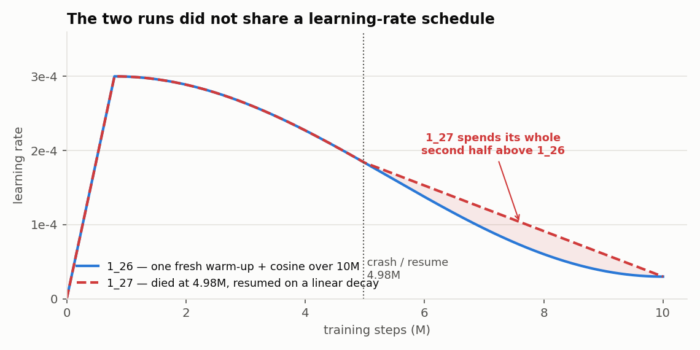
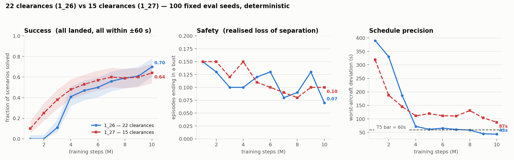

# 22 clearances vs 15

!!! abstract "TL;DR"
    Run `1_27` changes exactly one thing on top of `1_26`: the clearance set, from **22 actions
    to 15**. The set was specified by the domain experts, every cut is backed by measured usage,
    and it adds one genuinely new capability — **`SHORTEN_TROMBONE`**, the ability to undo a
    delay the agent had previously added.

    **It did not beat the full set.** At 10M steps on the same 100 seeds: success **0.70 → 0.64**
    (a statistical tie) and worst-aircraft deviation **43 s → 87 s** (not a tie). The reduced set
    is markedly *more sample-efficient* — at 2M steps it is at 0.25 success where the full set is
    at 0.00 — and then it plateaus where the full set keeps sharpening.

    **The comparison is not decisive**, because run `1_27` crashed at 4.98M steps and resumed on a
    *different learning-rate schedule*, which would leave the same fingerprint. A clean re-run is
    the recommendation.

Source: `actions/actions_v1.py`, `actions/actions_v2.py`, `actions/action_set.py`,
`experiments/*/progress_scored.csv`, `analysis/2026-08-17_1_27_*`.

---

## Why the set was reduced at all { #why }

Not for its own sake. It came out of a specific measurement — see
[test log, 11 Aug](analysis_log.md#t-attempts-1_26).

Of run `1_26`'s 18 unsolvable seeds, **12 were precision-bound**: they never lose separation,
they land everything, and they top out at tier 4 because one aircraft misses the ±60 s bar. All
twelve end **late**, and on all twelve the agent **lengthens the trombone in 12 of 12 episodes at
roughly 5× the pool-average rate**.

That is a trap, and it was structural. Under v1 the trombone was a **one-way door**: four
`LENGTHEN_TROMBONE_n` clearances existed and no shortening clearance existed at all. Speed
authority could not compensate — six consecutive `SPEED_UP_LARGE` move landing time by only
**−18 s**, against **+339 s** for six `SLOW_DOWN_LARGE`, because arrivals already sit near their
speed ceiling. So an agent that over-delayed early had no action available to recover.

The second observation was that most of v1 was never used. From the 100-seed clearance log
([11 Aug](analysis_log.md#t-try25-1_26)), everything v2 drops accounts for **7.16%** of all
clearances issued.

---

## The two sets, side by side { #sets }

=== "v1 — 22 clearances (runs ≤ `1_26`)"

    ```
     0  DO_NOTHING                                12  TURN_RIGHT_SKIP_1_AND_RETURN_TO_ROUTE_10
     1  SPEED_UP_SMALL                            13  LENGTHEN_TROMBONE_1
     2  SPEED_UP_LARGE                            14  LENGTHEN_TROMBONE_2
     3  SLOW_DOWN_SMALL                           15  LENGTHEN_TROMBONE_3
     4  SLOW_DOWN_LARGE                           16  LENGTHEN_TROMBONE_4
     5  TURN_LEFT_AND_RETURN_TO_ROUTE_5           17  SKIP_1_WAYPOINT
     6  TURN_RIGHT_AND_RETURN_TO_ROUTE_5          18  SKIP_2_WAYPOINTS_NOT_NEXT
     7  TURN_LEFT_AND_RETURN_TO_ROUTE_10          19  SKIP_3_WAYPOINTS_NOT_NEXT
     8  TURN_RIGHT_AND_RETURN_TO_ROUTE_10         20  SKIP_4_WAYPOINTS_NOT_NEXT
     9  TURN_LEFT_SKIP_1_AND_RETURN_TO_ROUTE_5    21  VECTOR_TO_ILS
    10  TURN_RIGHT_SKIP_1_AND_RETURN_TO_ROUTE_5
    11  TURN_LEFT_SKIP_1_AND_RETURN_TO_ROUTE_10
    ```

    Eight of these twenty-two are turn variants, and four more are trombone levels that only
    go one way.

    Frozen in `actions/actions_v1.py` and never edited again, so run `1_26` stays replayable.

=== "v2 — 15 clearances (runs ≥ `1_27`)"

    ```
     0 DO_NOTHING              5 SPEED_UP_MEDIUM      10 SKIP_1_WAYPOINT
     1 SLOW_DOWN_SMALL         6 TURN_LEFT_..._ROUTE  11 SKIP_2_WAYPOINTS_NOT_NEXT
     2 SLOW_DOWN_MEDIUM        7 TURN_RIGHT_.._ROUTE  12 SKIP_3_WAYPOINTS_NOT_NEXT
     3 SLOW_DOWN_LARGE         8 LENGTHEN_TROMBONE    13 SKIP_4_WAYPOINTS_NOT_NEXT
     4 SPEED_UP_SMALL          9 SHORTEN_TROMBONE     14 VECTOR_TO_ILS
    ```

    Ids are contiguous 0–14 and **do not correspond to v1's ids**. Marker `8` means a right turn
    under v1 and `LENGTHEN_TROMBONE` under v2 — which is why the render's action legend is now
    generated from the active enum rather than a fixed table.

### What changed, and the evidence for each change { #changes }

| change | v1 | v2 | evidence |
|---|---|---|---|
| **Turn variants collapsed** | 8 | 2 | Only the plain 10 NM rejoin saw real use (1.54% left / 1.17% right on run `1_25`). The 5 NM and skip-1 variants were 0.02–0.6% each |
| **Trombone made reversible** | 4 absolute levels, one-way | 1 reversible pair, stacking | The 12 precision-bound seeds, above. This is the substantive addition |
| **`SPEED_UP_LARGE` dropped** | present | removed | 6× `SPEED_UP_LARGE` = −18 s of landing time vs +339 s for 6× `SLOW_DOWN_LARGE`. It was 1.4% of clearances |
| **MEDIUM speed steps added** | ±10 / ±30 kt | ±10 / ±20 / ±30 kt | Fills the gap between a step too small to matter and one that overshoots |
| **Set made asymmetric** | 2 up, 2 down | **2 up, 3 down** | Deliberate: arrivals sit near their speed ceiling, so slowing has far more authority than speeding up |

!!! note "`LENGTHEN`/`SHORTEN` are exact inverses, and they stack"
    Three lengthens with no shorten between them give +3; capacity is 4 levels. Shortening
    cannot go below the baseline route — every aircraft starts with its trombone fully cut out,
    so shorten only ever undoes the agent's own prior lengthening. The unwind is stack-based
    because insertions nest (`A, f1..fn, bn..b1, B`), and only levels not yet flown past are
    removable. Verified directly: 3 lengthens + 3 shortens restore the exact original route on
    4/4 aircraft, and 30 randomly interleaved operations leave route length and store capacity
    identical to the start.

### How a set is selected { #selection }

```python
ACTION_SET = os.getenv("TADA_ACTION_SET", "v2")     # config/config.py:217
_ACTION_SET_SIZES = {"v1": 22, "v2": 15}
NUM_ACTIONS = _ACTION_SET_SIZES[ACTION_SET]
```

An **environment variable**, not a CLI flag, because `actions/action_set.py` reads it at *import*
time — it sizes the action space, the clearance head, the mask and the action-history one-hot, so
a flag parsed inside `main()` would arrive far too late.

`check_checkpoint_compatible()` reads the clearance-head width straight out of a checkpoint zip
and exits with the remedy rather than a raw tensor-shape error:

```
Checkpoint/action-set mismatch.
  experiments/atc_run_1_26_sep3nm/checkpoints/ppo_tada_9950000_steps.zip
  was trained with 22 clearances, but ACTION_SET='v2' has 15.
Re-run with:
  TADA_ACTION_SET=v1 python <your command>
```

---

## What the training run showed { #results }

Run `1_27` launched 11 Aug at commit `4a170c6`, 10M steps, MXP trombone, on top of run `1_26`'s
MDP with only the clearance set changed. It completed 12 Aug.

### The confound, stated first { #confound }

`1_27` **is not a clean single-variable experiment**, and the reason matters.

It died at **4 975 000** steps and was resumed the next morning. `main.py::_resume_lr_schedule`
does not continue the original cosine — it builds a **linear** decay from the learning rate the
checkpoint was at (1.846e-4) down to the same floor (3e-5) over the remaining steps. Both runs
start at 3e-4 and end at 3e-5; `1_27` spends its whole second half above `1_26`.



!!! danger "The confound points the same way as the effect"
    A higher late learning rate is exactly what prevents the fine convergence that
    **worst-aircraft deviation** needs — and worst-aircraft deviation is precisely where `1_27`
    underperforms. It therefore **cannot be ruled out** as the cause.

    This project has been caught by this before: `1_21` and `1_22` are *byte-identical code*, and
    a fresh warm-up-plus-cosine versus a resume onto a flat rate was the entire difference
    between them.

Two smaller differences rode along, both believed harmless: eval and checkpoint cadence moved
from 5k/10k to 25k steps — which makes `1_27`'s `best_model` a *less* extreme argmax than
`1_26`'s, so if anything it flatters `1_27` on that one metric — and the bit-identical
observation-build speed-up.

### Head to head { #head-to-head }



| at 10M steps | success | 95% CI | separation | clean-subset | tier | worst-ac dev |
|---|---|---|---|---|---|---|
| **`1_26` — 22 clearances** | **0.70** | 0.60–0.78 | 0.07 | **0.753** | 4.38 | **43.4 s** |
| **`1_27` — 15 clearances** | **0.64** | 0.54–0.73 | 0.10 | **0.711** | 4.01 | **87.3 s** |

!!! note "Scored twice, and the spread is the error bar"
    An independent same-day re-score of the same two checkpoints on the same pool returned
    **0.69 / 41.3 s** and **0.60 / 92.3 s**
    (`analysis/2026-08-17_1_2{6,7}_at10M_perseed.csv`). The observation frame comes from a global
    RNG `reset()` never reseeds, so repeat scoring of one checkpoint moves by a few seeds — here,
    1 seed for `1_26` and 4 for `1_27`. **Both draws support the same two conclusions.**

**Success is a tie.** The gap is 0.06 on the tracked series and 0.09 on the re-score, against a
95% threshold of ≈0.13 at this sample size (see
[Wilson intervals](analysis_methods.md#wilson)). Claiming that 22 clearances beat 15 on success
is reading noise.

**Worst-aircraft deviation is not a tie**, and the curve shape is the real evidence:

| steps | 1_26 max dev | 1_27 max dev | | 1_26 success | 1_27 success |
|---|---|---|---|---|---|
| 1M | 390.0 s | 318.8 s | | 0.00 | **0.10** |
| 2M | 330.8 s | 188.0 s | | 0.00 | **0.25** |
| 3M | 186.5 s | 145.3 s | | 0.11 | **0.38** |
| 4M | **72.2 s** | 111.3 s | | 0.41 | **0.48** |
| 5M | **61.4 s** | 119.5 s | | 0.47 | **0.53** |
| 6M | **65.5 s** | 111.5 s | | 0.50 | **0.57** |
| 7M | **61.0 s** | 110.9 s | | 0.56 | **0.60** |
| 8M | **58.5 s** | 130.7 s | | 0.59 | 0.59 |
| 9M | **44.8 s** | 103.8 s | | **0.61** | 0.60 |
| 10M | **43.4 s** | 87.3 s | | **0.70** | 0.64 |

Two clean readings come out of this table:

1. **The reduced set is much more sample-efficient.** `1_27` leads on success at *every*
   checkpoint through 7M. At 2M it is at 0.25 where `1_26` is at exactly 0.00. A smaller action
   space is easier to explore, and it shows immediately.
2. **It then stops improving where `1_26` doesn't.** From 4M on, `1_26`'s worst-aircraft
   deviation walks down 72 → 43 s and crosses the ±60 s bar that T5 requires. `1_27` never gets
   below 87 s — still 1.45× the bar. They cross over on success at 8M.

### The two policies disagree in both directions { #per-seed }

Averages hide this. Seed by seed at 10M, deterministic:

| | scenarios |
|---|---|
| both solve | **49** |
| only `1_26` (22 clearances) solves | **20** |
| only `1_27` (15 clearances) solves | **11** |
| neither solves | **20** |

So v2 is **not a strictly worse policy** — it wins 11 scenarios v1 cannot solve greedily. It is a
differently-shaped one that loses more trades than it wins. Mean worst-aircraft deviation
restricted to **clean** episodes is 44.4 s (v1, n=92) against 89.8 s (v2, n=93), so the precision
gap is not an artefact of busts either.

### Did `SHORTEN_TROMBONE` earn its place? { #shorten-verdict }

This is the question the whole change was built around — and it has a clean answer.

**No. The agent issues it 5 times in 5 162 clearances.**


| manoeuvre family | `1_26` (v1) | `1_27` (v2) |
|---|---|---|
| slow down | 3 077 · 58.7% | 2 971 · 57.6% |
| speed up | 994 · 19.0% | 1 145 · 22.2% |
| **lengthen trombone** | 628 · 12.0% | **713 · 13.8%** |
| **shorten trombone** | — (does not exist) | **5 · 0.10%** |
| skip waypoints | 458 · 8.7% | 316 · 6.1% |
| turn off / rejoin | 88 · 1.7% | 12 · 0.2% |
| **total issued** | **5 245** | **5 162** |

The agent **lengthens 143× more often than it shortens**. So the mechanism intended to rescue
the precision-bound scenarios never engaged — and, correspondingly, they were not rescued:


| attempts-to-solution, 100 seeds, cap 20 | `1_26` | `1_27` |
|---|---|---|
| deterministic | 0.63 | 0.62 |
| pass@1 | 0.56 | **0.58** |
| pass@20 | **0.82** | 0.74 |
| never solved in 20 | **18** | 26 |
| — precision-bound | 12 | **18** |
| — safety-bound | 6 | **3** |
| — mixed | 0 | 5 |

!!! danger "Zero of twelve"
    `1_27` solves **none** of `1_26`'s 12 precision-bound seeds within 20 attempts. All twelve
    remain censored and six more join them. The reduced set was designed for exactly these
    scenarios.

**What did move:** safety-bound failures halved, 6 → 3 — `1_27` solves three seeds
(`41`, `1242911821`, `1632629719`) that `1_27`'s predecessor could not fly safely at all. And
pass@1 is marginally *better* while pass@20 is clearly worse, which is the signature of a
tighter action distribution: a better first guess, less left for sampling to find.

Full detail and the raw tables: [test log, 17 Aug](analysis_log.md#t-shorten-usage).

### The verdict, and what it does and does not license { #verdict }

!!! abstract "Three statements, in decreasing confidence"
    1. **`SHORTEN_TROMBONE` is not being used, and the precision-bound scenarios are not fixed.**
       5 clearances in 5 162, and 0 of 12 seeds. This is a direct observation and does not depend
       on the confound at all.
    2. **The reduced set is markedly more sample-efficient.** 0.25 success at 2M steps against
       0.00, leading at every checkpoint through 7M. Also confound-independent — the runs are
       identical up to 4.98M.
    3. **The reduced set converges to worse schedule precision.** 87 s against 43 s. This is the
       one claim the [resume confound](#confound) touches, and it touches it in the same
       direction, so it cannot be promoted past "consistent with" until a clean run exists.

**Recommendation.** Re-run v2 uninterrupted on `1_26`'s exact schedule
(`--total-timesteps 10000000 --warmup-frac 0.08`). That separates statement 3 from the learning
rate for ~19 h of compute. Independently of which set wins, the finding that matters is
statement 1: **giving the agent a corrective action is not the same as giving it a reason to
learn one** — which is a reward-shaping and exploration problem, and the next design question
worth spending a run on.
