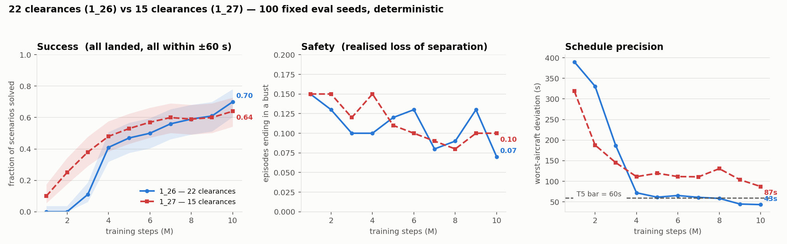
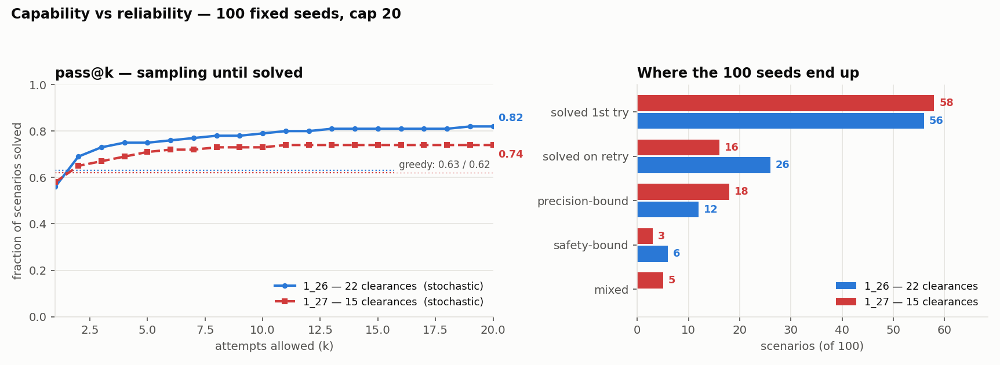
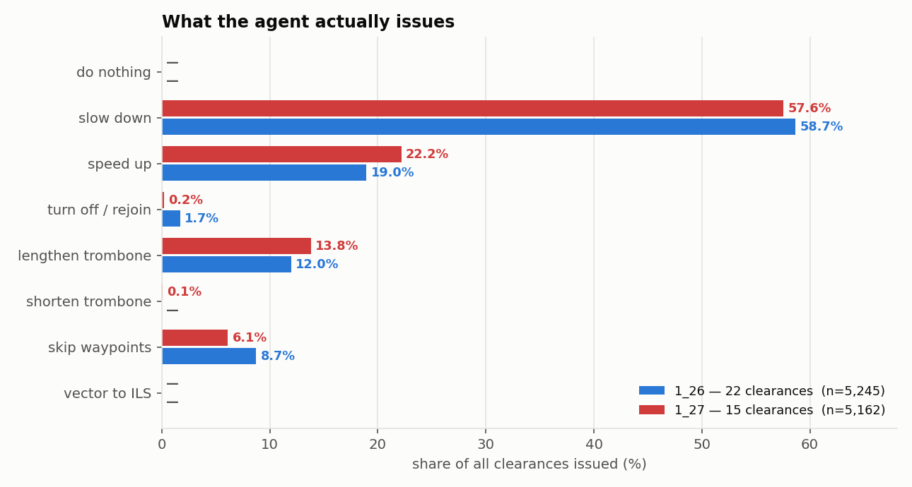
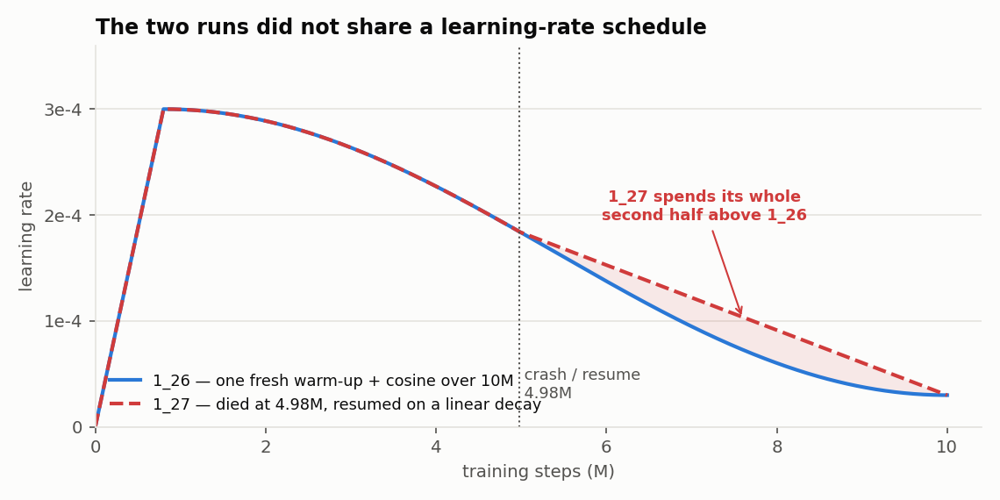
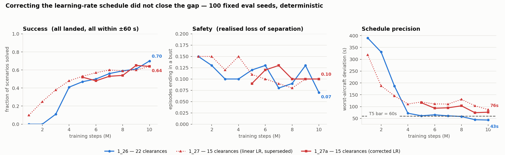

# 22 clearances vs 15

!!! abstract "Summary"
    Run `1_27` changed one thing on top of `1_26`: the clearance set, from 22 actions to 15 (set
    `v2`). The domain experts specified the set, measured usage backed every cut, and it added one
    new capability, `SHORTEN_TROMBONE`, to undo a delay the agent had added. **It did not beat the
    full set.** It learned much faster, then converged to markedly worse worst-aircraft precision,
    with a success difference inside the noise. The agent issued `SHORTEN_TROMBONE` about once per
    thousand clearances and rescued none of the scenarios it was built for. A learning-rate
    confound was removed by re-running the second half (`1_27a`); nothing changed. **Giving the
    agent a corrective action is not the same as giving it a reason to learn one.** `v2` stayed the
    default: every current model uses it.

Cards: [`1_26`](../models/1_26.md), [`1_27`](../models/1_27.md), [`1_27a`](../models/1_27a.md).
Data: `analysis/2026-08-1{7,8}_*`, each run's `progress_scored.csv`.

## Why reduce the set

Of `1_26`'s 18 seeds unsolved in 20 attempts, **12 were precision-bound**: safe, everything landed,
topping out at tier 4 because one aircraft missed ±60 s. All twelve ended **late**, and on all
twelve the agent lengthened the trombone, at ~5× the pool-average rate. Under `v1` the trombone was a
one-way door (four `LENGTHEN_TROMBONE_n`, no shorten), and speed could not compensate: six
consecutive `SPEED_UP_LARGE` move a landing by −18 s against +339 s for six `SLOW_DOWN_LARGE`.
Separately, everything `v2` drops made up 7.16% of all clearances issued in `1_26`'s 100-seed log.

| change | v1 | v2 | evidence |
|---|---|---|---|
| turn variants | 8 | 2 | only the plain 10 NM rejoin saw real use (1.54% left / 1.17% right on `1_25`); the others 0.02–0.6% each |
| trombone | 4 absolute levels, one-way | ±1 level, reversible, stacking | the 12 precision-bound seeds |
| `SPEED_UP_LARGE` | present | removed | −18 s for six; 1.4% of clearances |
| MEDIUM speed steps | — | ±20 kt | fills the gap between too small and overshoot |
| asymmetry | 2 up, 2 down | 2 up, 3 down | arrivals sit near their speed ceiling |

`v1`'s ids do not map to `v2`'s (marker 8 is a right turn under `v1`, `LENGTHEN_TROMBONE` under
`v2`). `v1` is frozen in `actions/actions_v1.py` so `1_26` stays replayable with
`TADA_ACTION_SET=v1`.

## Results

At 10M steps, 100 seeds, deterministic (tracked series):

| | success | 95% CI | separation | clean-subset | tier | worst-aircraft dev |
|---|---|---|---|---|---|---|
| `1_26` (22) | 0.70 | 0.60–0.78 | 0.07 | 0.753 | 4.38 | 43.4 s |
| `1_27` (15) | 0.64 | 0.54–0.73 | 0.10 | 0.711 | 4.01 | 87.3 s |
| `1_27a` (15, correct LR) | 0.64 | | 0.10 | 0.711 | 4.04 | 76.5 s |

**Success is a tie; precision is not.** The success gap is inside the ≈0.13 threshold, while the
worst-aircraft gap is not. The curves show the shape: `1_27` leads on success at every checkpoint
through 7M (0.25 at 2M where `1_26` is at 0.00), they meet at 8M, and from 4M on `1_26`'s
worst-aircraft deviation walks from 72 s down to 43 s, crossing the ±60 s bar, while `1_27` never
gets below 87 s.

**They disagree in both directions.** Per seed at 10M: 49 both solve, 20 only `1_26`, 11 only
`1_27`, 20 neither. Restricted to clean episodes the worst-aircraft gap persists (44.4 s vs 89.8 s),
so it is not an artefact of losses.

**Attempts to solve** (100 seeds, cap 20):

| | `1_26` | `1_27` | `1_27a` |
|---|---|---|---|
| deterministic | 0.63 | 0.62 | 0.62 |
| pass@1 | 0.56 | 0.58 | 0.61 |
| pass@20 | **0.82** | 0.74 | 0.74 |
| never solved (precision / safety / mixed) | 18 (12 / 6 / 0) | 26 (18 / 3 / 5) | 26 (18 / –) |
| of `1_26`'s 12 precision-bound seeds, solved | — | **0** | **0** |

A tighter action distribution gives a better first guess and leaves less for sampling to find.
Safety-bound failures halved; precision-bound ones grew by half.

**`SHORTEN_TROMBONE` usage** (100 seeds, 25 attempts each, clearance logs):

| family | `1_26` (v1) | `1_27` (v2) |
|---|---|---|
| slow down | 3 077 · 58.7% | 2 971 · 57.6% |
| speed up | 994 · 19.0% | 1 145 · 22.2% |
| lengthen trombone | 628 · 12.0% | 713 · 13.8% |
| **shorten trombone** | — | **5 · 0.10%** |
| skip waypoints | 458 · 8.7% | 316 · 6.1% |
| turn off / rejoin | 88 · 1.7% | 12 · 0.2% |

`1_27a`: 6 in 5 425. Nothing is wrong with the action: it is an exact inverse, restores routes
byte-for-byte under test, and is legal whenever there is a level to remove. The agent never learned
to reach for it.

## The confound, and its removal { #confound }

`1_27` crashed at 4 975 000 steps and resumed onto a **linear** decay from the checkpoint's learning
rate instead of the cosine, so its whole second half trained up to 1.6× hotter than `1_26`. A higher
late learning rate prevents exactly the fine convergence where `1_27` fell short. `1_27a` resumed
from the same checkpoint on the cosine (reconstructed learning rate within 0.06% of the
checkpoint's). Success did not move; deviation closed 10.8 s of a 43.9 s gap, and none of that
survives restricting to clean episodes (92.8 s vs 89.8 s). At 9M `1_27a` briefly led `1_26`, then
fell back: see [Evaluation noise](../findings/evaluation-noise.md).

## Why it failed: a hypothesis

Lengthening pays immediately: it moves a conflict away, and the dense conflict penalty falls on the
next step. Shortening pays only at landing, through the deviation term, and costs an action now. To
discover it the agent must first over-delay and then recover, and every step of that detour scores
worse than not trying. That is an exploration and credit-assignment problem, not an action-space
one. Potential-based *advice* over state-action pairs
([the 10-aircraft reward](ten-aircraft-reward.md#advice)) was the proposed mechanism; the windowed
track's lexicographic objective later removed the dense costs altogether.

## Renders

The six A/B clips once shown here cannot be attributed with certainty (no metadata, frame seed not
recorded). They are in the [gallery archive](../renders.md#archive-attribution-unknown). The
verified reel of `1_27` over eight evaluation seeds is on its [card](../models/1_27.md).
