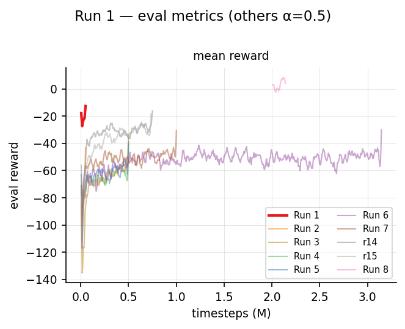
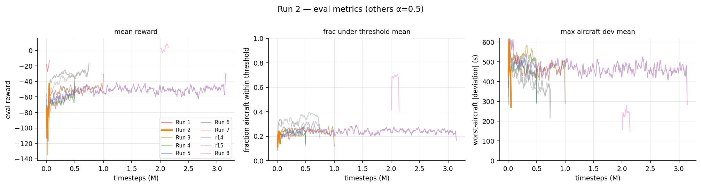
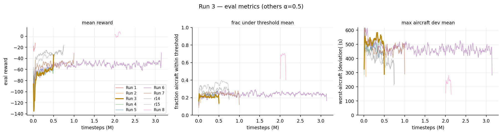
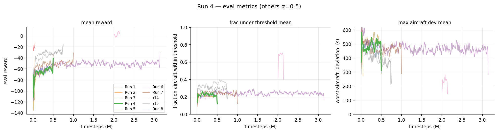
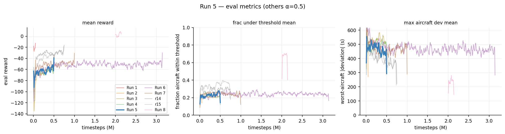
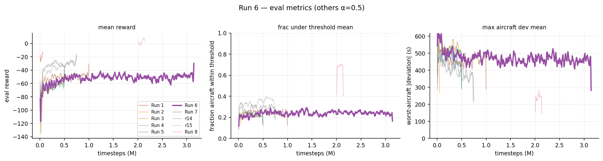
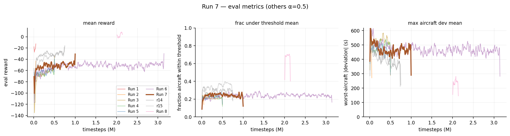
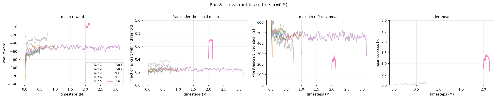

# Early runs (1–10)

!!! abstract "Summary"
    Runs 1–7 tuned the reward, the observation scaling and the optimiser. They brought conflicts
    under control, but schedule deviation stuck at a ceiling (worst aircraft ~360–390 s, ~30% of
    aircraft within ±30 s) that none of the tuning moved, and no episode ever met the
    all-within-±30 s success gate. Run 8 (`1_16`) broke the ceiling with a tiered success ladder
    and an autoregressive policy. Runs 9–10 tested a halved 22 s action interval, which lost.
    Numbers here are TensorBoard eval rewards and in-training metrics from before offline scoring
    existed: read them as trends, not measurements ([Evaluation noise](../findings/evaluation-noise.md)).

| # | run | steps | change | outcome | blocker it exposed |
|---|---|---|---|---|---|
| 1 | `1_4` | 50k | SB3 MaskablePPO baseline, original reward | eval reward −35 → −20 | acts every step; deviation outweighs conflict ~10:1; global features 27% saturated; no success notion |
| 2 | `1_5` | 50k | reward/obs redesign: imminence-dominant conflict, landing-weighted deviation, action cost, terminal success | −176 → −66; do-nothing 16% → 52% | "no near-conflict *ever*" gate unsatisfiable; deviation crowded out |
| 3 | `1_8` | 500k | deviation weight ×2, cheaper mid-range conflicts, gate relaxed to "clear for the final 3 steps" | −156 → −60, plateau by 150k | deviation stuck; value loss ~7210; entropy collapse |
| 4 | `1_9` | 500k | simulator-only deviation, `ent_coef` 0.01, reward VecNormalize, gradient logging | best −51; value loss 7210 → 0.03 | gradients clipped on 85–100% of updates |
| 5 | `1_10` | 500k | `max_grad_norm` 0.5 → 1.5 | best −45; clip fraction ~0.2 | the ceiling holds: action granularity and a flat gradient near the goal |
| 6 | `1_12` | 3.14M of 5M | dense goal bonus `2·exp(−total_dev/400 s)`; per-run experiment directories | best −33 @ 1.25M, then regressed | late KL blow-up (0.015 → 0.22) |
| 7 | `1_13` | 1M | KL control: LR decay 3e-4 → 3e-5, 5 epochs, `target_kl` 0.03 | KL tamed (0.002), best −37 @ 425k, then regressed | `all_under_threshold` = 0 all run: the gate is bound purely by per-aircraft deviation |
| 8 | [`1_16`](../models/1_16.md) | ~7.1M | five-tier ladder, autoregressive policy, per-scenario horizon, DOF action cost | first non-zero success; worst aircraft ~99 s | oscillates instead of converging |
| 9 | [`1_16_a`](../models/1_16_a.md) / [`1_16_b`](../models/1_16_b.md) | 2 → 4M | 45 s control vs 22 s interval with a warm LR restart | 22 s briefly best per-aircraft, then collapsed | a mid-run regime change confounds the interval |
| 10 | [`1_17`](../models/1_17.md) | 5.14M | 22 s from scratch, every duration doubled | lost | every later run is back on 45 s |

## What the sequence established

- **Conflicts yield to reward design, deviation does not yield to tuning.** Runs 2–3 got every
  aircraft landing and the (forecast) near-conflict gate satisfied. Runs 4–7 fixed value scaling,
  entropy, gradient clipping and KL, and each fix was real, but the deviation floor barely moved.
- **The success gate needed gradient, not relaxation.** A ladder whose top rungs cap the worst
  aircraft gave the terminal signal a slope and broke the ceiling (run 8).
- **Acting more often is not finer control.** The 22 s interval doubled the credit-assignment
  horizon and compute for no return. The extra bandwidth the agent needed came, much later, from
  [reselection](../how/actions.md#reselection) within the 45 s step.
- The conflict metric these runs reported (near 1.0) was a forecast. Real losses of separation were
  far more common, which only [`1_25`](../models/1_25.md)'s realised gate showed.

## Eval curves

TensorBoard eval metrics of runs 1–8 (`analysis/plot_eval_metrics.py`).

=== "Run 1"
    
=== "Run 2"
    
=== "Run 3"
    
=== "Run 4"
    
=== "Run 5"
    
=== "Run 6"
    
=== "Run 7"
    
=== "Run 8"
    
