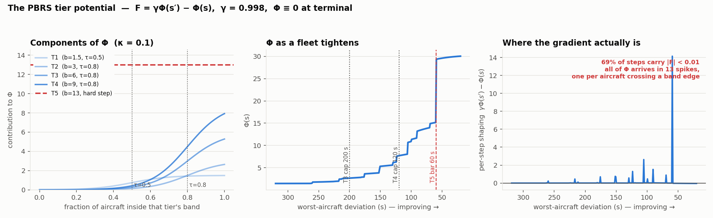

# The 10-aircraft reward

!!! abstract "Summary"
    The 10-aircraft env paid five dense terms every step: landing-weighted deviation, predicted
    conflict, an action cost, a goal bonus, and a five-tier success ladder delivered as
    potential-based shaping. A realised loss of separation cost `30 + 0.5 × remaining steps` and
    ended the episode. Two measured defects shaped what came next. The tier potential was a
    **staircase**: it paid only when an aircraft crossed a band edge, with a 13-point cliff at the
    top. And the action cost was not potential-based, so it changed which policy was optimal. `1_29`
    made the potential continuous; the windowed track replaced the whole design with the
    [lexicographic objective](../how/objective.md).

Source: `actions/rewards.py`, `utils/reward_utils.py`, `config/config.py`.

## The terms

| term | form | notes |
|---|---|---|
| deviation | `−Σ weight(ttl)·\|dev\| / 2000` | from the do-nothing rollout; weight 0.2 far from landing → 1.0 at landing |
| conflict | `−10 · Σ_pairs severity · 2^(−ttc/240 s)` | earliest predicted conflict per pair; 3–5 NM [severity](../how/separation.md#severity) (from `1_26`) |
| action | `−n^1.25 · 0.02 · dof`, `dof = 1 + 3·(20 − remaining waypoints)/20` | acting late costs up to 3.85× |
| goal bonus | `exp(−total_dev/S) · exp(−max_dev/200 s)` | a dense carrot (runs 6–7 onward) |
| tier ladder | PBRS `γΦ(s′) − Φ(s)`, Φ = 0 at terminal | below |
| violation | `−(30 + 0.5 × remaining steps)`, ends the episode | the forfeit term removes the incentive to bail out early when step rewards are negative |

The conflict half-life of 240 s replaced a cubic ramp whose *effective* half-life was 248 s. The two
agree within 0.02 inside 5 minutes; the exponential keeps a gradient in the far field (0.074 at
15 min vs 0.016).

## The tier ladder

| tier | requirement | weight |
|---|---|---|
| T1 | ≥ 50% of aircraft within ±120 s | 1.5 |
| T2 | ≥ 80% within ±100 s | 3.0 |
| T3 | ≥ 80% within ±70 s and worst < 200 s | 6.0 |
| T4 | ≥ 80% within ±60 s and worst < 120 s | 9.0 |
| **T5 = success** | every aircraft landed within ±60 s | 13.0 |

It replaced an all-or-nothing ±30 s gate that never fired in runs 1–7. The worst-aircraft caps at T3–T4
aim at exactly the quantity that had floored every run. Runs `1_23`, `1_24` and `1_24_pms` used a
six-tier variant down to ±30 s, whose tier means do not compare.

## The staircase potential { #staircase }

```
Φ(s) = Σ_{j=1..4} b_j · σ((cover_j − τ_j)/0.1)   [T3, T4 also × σ((cap_j − max_dev)/30 s)]
     + 13 · 1[every aircraft within ±60 s]
```



`cover_j` is a **fraction of ten aircraft**, so it takes only eleven values. Smoothing a variable on
an 11-point lattice does not make Φ smooth. Φ changed when, and only when, an aircraft crossed a
band edge. Moving an aircraft from 130 s to 65 s earned nothing unless it crossed 120 s or 60 s. The
T5 term was an unsmoothed 13-point cliff. Measured on a tightening sweep, 69% of steps carried
|F| < 0.01, and the largest spike was 14.2.

**Fix (shipped in `1_29`, `PBRS_CONTINUOUS_COVER`):** each aircraft contributes a soft membership
`σ((d_j − |dev_i|)/κ_dev)` instead of a hard count, and T5 becomes `σ((60 − max_dev)/κ_dev)`. On the
same sweep, flat steps fell from 69% to 32% and the largest spike from 14.16 to 0.30, with the range
of Φ nearly unchanged (30.1 → 28.8). Φ is still a function of state alone, so policy invariance
holds; the tier actually *awarded* still uses hard counts.

## The action cost as advice { #advice }

The action cost is a plain reward term, not potential-based, so by Ng et al.'s necessity result it
can change which policy is optimal. The proposed fix composes three results. Wiewiora et al. (2003)
extend potentials to state-action *advice*. Devlin & Kudenko (2012) keep the guarantee for
time-varying potentials. Harutyunyan et al. (2015) learn a secondary value function on the negated
cost and use it as the advice potential, so the shaping reflects the cost in expectation without
changing the optimum. Here that would have meant a Φ head on the existing encoder, trained on
`−r_action`, with `r_action` removed from the total. Advice is defined over state-action pairs, so
it could also have expressed "this action is worth taking here", which is what `SHORTEN_TROMBONE`
lacked ([22 clearances vs 15](clearance-sets.md)). It was never built. The windowed objective made
the clearance count part of the objective itself, which is where it belongs.

## References

1. Ng, Harada & Russell (1999), *Policy invariance under reward transformations*. ICML.
2. Wiewiora, Cottrell & Elkan (2003), *Principled methods for advising reinforcement learning agents*. ICML.
3. Devlin & Kudenko (2012), *Dynamic potential-based reward shaping*. AAMAS.
4. Harutyunyan, Devlin, Vrancx & Nowé (2015), *Expressing arbitrary reward functions as potential-based advice*. AAAI.
5. Grześ (2017), *Reward shaping in episodic reinforcement learning*. AAMAS. Terminal potentials matter; zero is the safe choice.
