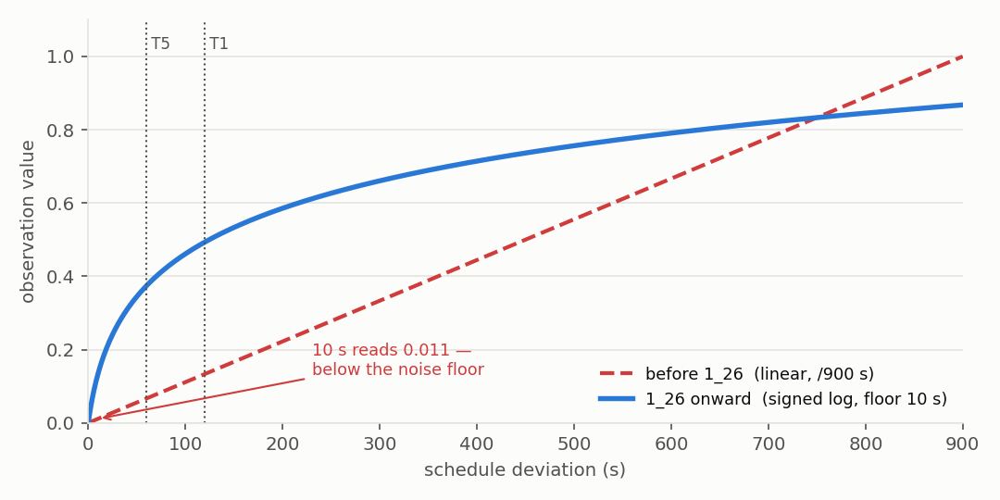
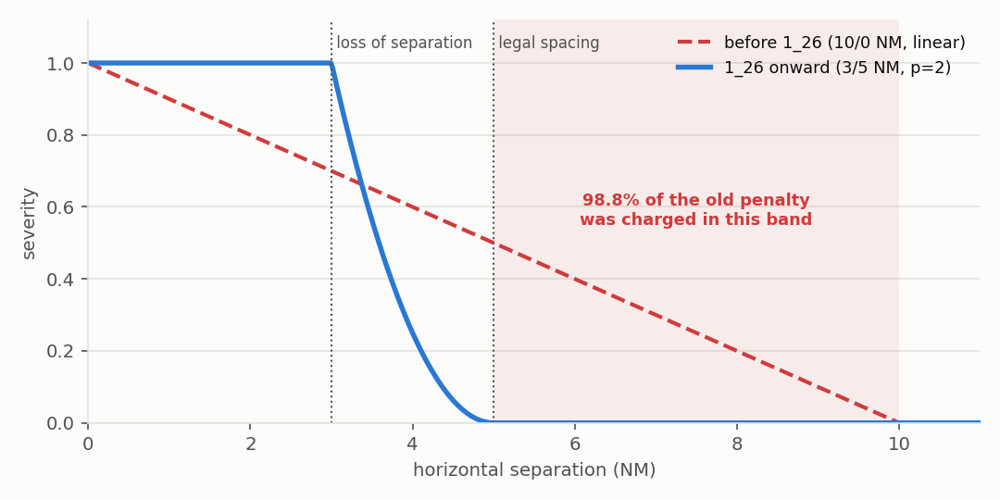
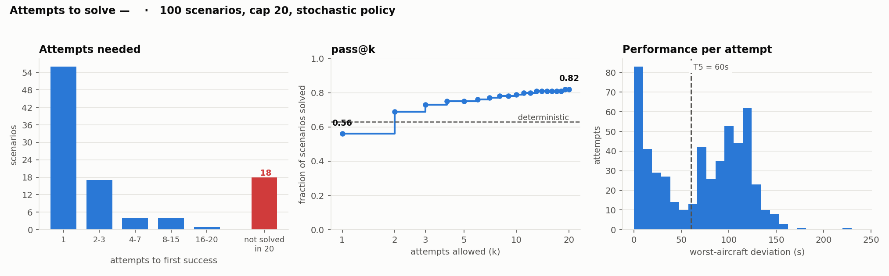
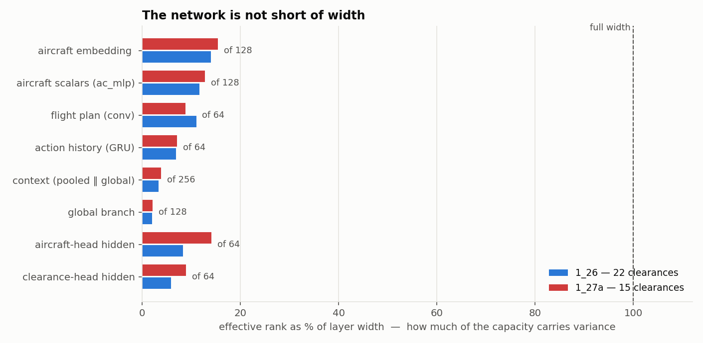

# 10-aircraft tests

!!! abstract "Summary"
    The audit trail of the 10-aircraft track: the checks that overturned something we believed.
    The in-training success rate measured nothing. The forecast success gate hid real losses of
    separation. Two thirds of aircraft had a pinned time feature. The scenario filter never fired.
    Slot order is inert. Most residual failures were precision, not safety. The network uses about
    an eighth of its width. Refusal shields made a tier-trained policy worse. Scores are on the
    [cards](../models/index.md); definitions in [Evaluation](../evaluation.md#the-10-aircraft-instruments).

## Instruments

- **Deterministic scoring** (`score_checkpoints.py`, `track_run.py`): 100 fixed seeds, greedy,
  success = tier 5, Wilson intervals. At p ≈ 0.6, SE ≈ 0.049, so an unpaired difference under ~0.14
  is noise. The observation frame was not pinned, so re-scoring moves a few seeds.
- **Attempts to solve** (`attempts_to_solve.py`): sample each scenario until solved, cap 20. The gap
  between pass@1 and the pass@k asymptote is *reliability* (recoverable at inference by best-of-n);
  the gap to 1.0 is *capability*. Unsolved seeds are **safety-bound** if ≥ 50% of attempts lose
  separation, **precision-bound** if < 20% do and none reach tier 5, else mixed.
- **Stochastic benchmark with a clearance log** (`render_policy.py --stochastic --attempts N
  --solutions-json`): every clearance issued, per aircraft, per step. Raw emitted actions, not a
  cleaned plan.
- **Refusal-shield sweep** (`analysis/2026-06-24_shield_benchmark/shield_benchmark.py`).
- **Clean set:** episodes without a loss of separation; clean-subset success = success / (1 −
  separation rate). It sat near 0.54 for twenty runs.

## The tests

**3 Aug. The meter was broken** (`1_22`). The in-training success rate read 1.00; deterministic
scoring on 100 seeds gave 0.38 ([Evaluation noise](../findings/evaluation-noise.md)).

**3 Aug. The forecast gate never bound, and hid real losses** (`1_22` checkpoints replayed with both
gates). The predicted gate was open in every episode at every checkpoint (0 relaxations in 95
episode-evaluations), yet the realised gate showed ~23% of episodes with a real loss of separation.
The logged 0.99–1.00 was a forecast that always cleared by the end.

**4 Aug. The gate change cost nothing** (`1_22` vs `1_25`, byte-identical but for the gate). The
differences sit inside the noise band: a semantics fix, reported success made honest.

**10 Aug. Features were saturated** (`analysis/obs_norm_audit.py`). `time_to_target` was pinned at ±1
in 65.6% of samples (MXP) and 71.4% (point merge), and the linear deviation encoding put every tier
boundary in the bottom 13% of its range. After log scaling: 18.1% and 15.1%; deviation clipping 3.2%
→ 0%. This is the change most likely behind `1_26`'s collapse in worst-aircraft deviation.

**10 Aug. The scenario filter was dead code** (`scenario_filter_probe.py`). It tested `severity >= 1.0`,
unreachable under the old band, so it always passed. The 3–5 NM band revived it as a side effect.

**10 Aug. `1_26`'s gains are not an easier MDP.** `1_25`'s policy scored under `1_26`'s rules
collapsed (success 0.44 → 0.11; `analysis/2026-08-10_1_25_under_1_26_mdp.csv`), so `1_26`'s rise was
the policy, not the scoring.

**11 Aug. Slot order is inert** (`ordering_sensitivity.py`, 25 scenarios × 8 orderings). First-action
agreement 100%, outcomes byte-identical: the context is permutation-invariant and the heads
equivariant. Shuffling slots as augmentation would buy nothing.

**11 Aug. Capability or reliability?** (`1_26`, 100 seeds, cap 20). Deterministic 0.63, pass@1 0.56,
pass@5 0.75, pass@10 0.79, pass@20 0.82. The 18 never solved split into **12 precision-bound**
(all tier 4, all late) and **6 safety-bound**. That table designed clearance set `v2`, and it
de-prioritised a multi-select head (12 of 18 residual failures never lose separation). Two smaller
25-seed probes had given higher numbers: that subset was easier than the pool.

**11 Aug. The clearance mix** (`1_26` @ 9.95M, 100 seeds × up to 25 tries). 83 of 100 solved.
Speed control dominates (`SLOW_DOWN_SMALL` 1995, `SLOW_DOWN_LARGE` 1082, `SPEED_UP_SMALL` 770);
`SPEED_UP_LARGE` 224; every turn variant beyond the plain rejoin in single or low double digits;
everything `v2` drops is 7.16% of the total.

**11 Aug. The stack works under both clearance sets** (`action_set_selftest.py`: nine checks pass under
`v1` and `v2`; three lengthens then three shortens restore the exact route).

**17–18 Aug. 22 clearances vs 15.** [Its own page](clearance-sets.md).

## Network capacity { #embedding-capacity }

**19 Aug** (`analysis/embedding_capacity.py`, `1_26` and `1_27a` at 10M, ~2 100 states each).
Effective rank, i.e. how many directions of a layer carry variance, against the layer's width:

| layer | width | eff. rank `1_26` / `1_27a` | used |
|---|---|---|---|
| aircraft embedding | 128 | 17.9 / 19.8 | 14–15% |
| ├ scalars | 128 | 15.0 / 16.3 | 12–13% |
| ├ flight plan (conv) | 64 | 7.1 / 5.7 | 9–11% (11–14% of units dead) |
| └ action history (GRU) | 64 | 4.4 / 4.6 | 7% |
| context | 256 | 8.5 / 9.8 | 3–4% |
| └ global branch | 128 | 2.6 / 2.8 | 2% |
| aircraft-head hidden | 64 | 5.3 / 9.0 | 8–14% |
| clearance-head hidden | 64 | 3.7 / 5.7 | 6–9% |

**The network is not short of width; a bigger one would not help.** The narrowest point was the
context, a masked mean over aircraft that cannot represent pairwise structure; aircraft embeddings
within a state had mean cosine 0.70–0.73. The proposed change was shape, not size: one
self-attention block over the slots, which `1_29` added. Caveat: effective rank measures variance,
not usefulness.

## The refusal-shield sweep (`1_16`) { #shield }

A shield is a one-step lookahead that vetoes the policy's clearance when it lowers predicted
reward (`reward-drop`), introduces a near-term conflict (`critical-conflict`), or both, and
substitutes `do_nothing` or the best passing clearance (`next_best`). `1_16` best model, 100 seeds,
simulator 0.1.52 (`analysis/2026-06-26_shield_benchmark_1_16/results.csv`):

| variant | fallback | mean tier | success | total \|dev\| | separation | refusals / episode |
|---|---|--:|--:|--:|--:|--:|
| do-nothing | — | 0.14 | 0% | 2552 s | 89% | — |
| random valid | — | 0.00 | 0% | 3941 s | 95% | — |
| **raw policy** | none | **3.37** | **52%** | **336 s** | 19% | 0 |
| reward-drop | do_nothing / next_best | 2.72 / 2.65 | 38% / 40% | 807 / 707 s | 25% / 26% | 77 / 80 |
| critical-conflict | do_nothing / next_best | 2.66 / 2.95 | 35% / 43% | 682 / 581 s | 18% / 17% | 16 / 12 |
| both | do_nothing / next_best | 2.52 / 2.76 | 32% / 41% | 927 / 809 s | 20% / 20% | 81 / 81 |

The raw policy was the strongest variant: a policy near-optimal for its own objective leaves nothing
for a greedy override. On the earlier, pre-tier `1_14` shields had helped. From commit `f9ecc24` to
`9560f92` the shield silently dropped every trombone clearance (a swallowed `deepcopy` error), so
shield results from that window understate `next_best`. The per-seed table is in the CSV.
