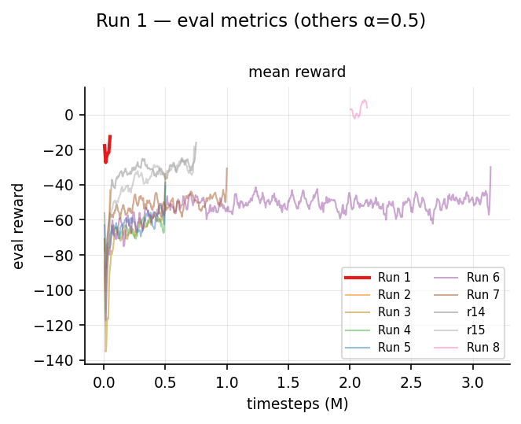
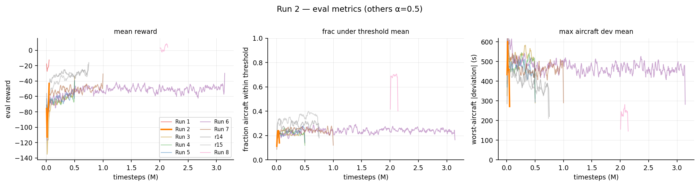
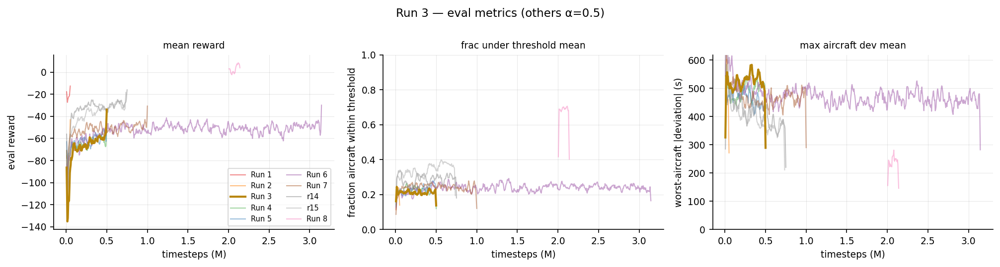
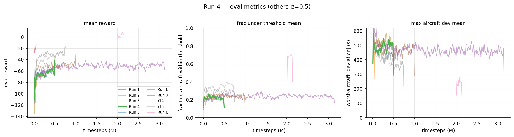
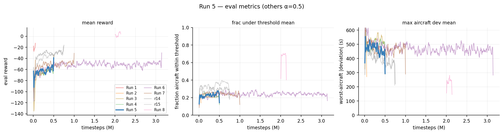
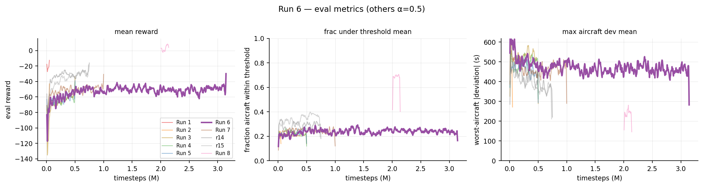
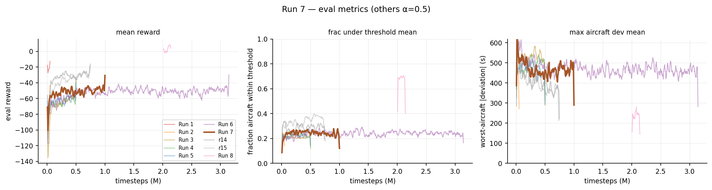
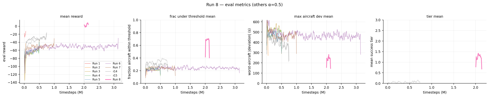
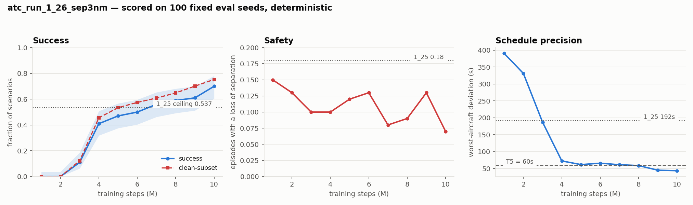
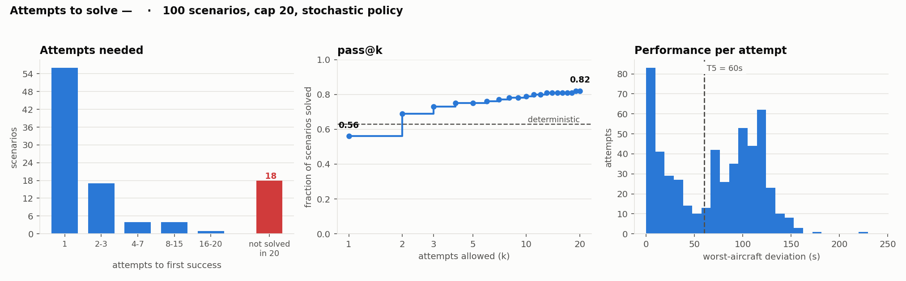

# Experiment log

!!! abstract "TL;DR"
    Run-by-run history. Runs 1–10 are narrated in detail below; **runs 1_18–1_27 are summarised
    together** in [one table](#recent-runs), because only from that point are the numbers
    comparable — everything there is scored by `analysis/track_run.py` on the same fixed
    100-seed pool.

    The headline: run **1_26** broke a deviation ceiling that twenty runs of reward and
    optimiser tuning had left intact, taking clean-subset success from **0.537 to 0.75** while
    *halving* losses of separation. Run **1_27** then tested the reduced 15-clearance set on top
    and **did not improve on it** — it learns markedly faster and converges slightly worse, with
    a confound that stops the comparison being decisive. Full analysis:
    [22 clearances vs 15](analysis_v1_v2.md).

    Also here: [changes outside the MDP](#non-mdp-changes) — rendering, tooling, and seven
    infrastructure bugs, several of which had been silently wrong for many runs.

A chronological record of the PPO training runs on branch `UM-lg`, what
changed in each, and what we learned. Runs 1–5 logged to `tb_logs/atc_run_1_N`;
from run `atc_run_1_11` onward each run is a **self-contained directory** under
`experiments/atc_run_1_N/` (TensorBoard + CSV in `tb/`, `checkpoints/`, `best/`, a
`snapshot/` of the source, plus `run_meta.json` and `git_diff.patch` for provenance).
The `atc_run_1_N` suffix increments each launch; the relevant ones are noted per run
(aborted/throwaway launches are skipped).

!!! note "How to read this"
    Each run isolates a small set of changes from the previous one. The **Finding**
    line is the takeaway that motivated the next run.

## Summary

| # | TB run | Steps | Headline change | eval reward | Binding blocker |
|---|--------|-------|-----------------|-------------|-----------------|
| 1 | `atc_run_1_4` | 50k | SB3 baseline (original reward) | −35 → **−20** | acts every step; deviation ≫ conflict; global obs 27% saturated |
| 2 | `atc_run_1_5` | 50k | Reward/obs **redesign** | −176 → **−66** | success gate unsatisfiable; deviation crowded out |
| 3 | `atc_run_1_8` | 500k | **Rebalance** + relaxed gate | −156 → **−60** (plateau ~150k) | deviation stuck; entropy collapse; value_loss huge |
| 4 | `atc_run_1_9` | 500k | Simulator-only deviation + **stability fixes** | −136 → **−51** | deviation **still** stuck; grads saturate clip (`clip_frac`≈1.0) |
| 5 | `atc_run_1_10` | 500k | **`max_grad_norm` 0.5 → 1.5** | −123 → **−45** | `clip_frac` unsaturated ✓; deviation ceiling persists |
| 6 | `atc_run_1_12` | 5M† | **Dense goal bonus** + per-run experiment dirs | −151 → **−33** | **best yet**, but late `approx_kl`→0.22 → regresses; deviation ceiling holds |
| 7 | `atc_run_1_13` | 1M | + **KL control** (LR decay, `n_epochs` 5, `target_kl` 0.03) | −117 → **−37** | KL tamed ✓; peaks @425k then regresses to −60; `all_under_threshold`=0 |
| 8 | `atc_run_1_16` | →7.1M† | **5-tier success** + autoregressive policy + per-scenario horizon + DOF action cost | **50% success peak** (@5.7M), ~30% plateau | worst-aircraft dev → **99 s** (ceiling broken); oscillates, not monotone |
| 9a | `atc_run_1_16_a` | 2→4M | 45 s **control** (Run 8 ckpt @2M continued) | ~40% peak, then drifts | reproduces Run 8 plateau/oscillation |
| 9b | `atc_run_1_16_b` | 2→4M | **½ interval 45→22 s** + warm-restart LR (`--initial-lr 1e-4`) | best per-AC dev (worst 99 s, tier1 0.98) but **regresses to ~0–10%** | 22 s transfer mid-run destabilising; inconclusive |
| 10 | `atc_run_1_17` | 5M (running) | **fresh** 22 s run (clean interval test) | — *(early training)* | results pending |

† Run 6 targeted 5M but was stopped at ~3.14M. `atc_run_1_11` (the launch that introduced
the goal bonus + experiment-dir scaffolding) aborted at ~2k steps and was relaunched as run 6.
`success_rate = 0` for runs 1–7: no episode ever gets *all* aircraft within the old ±30 s gate.
Run 8 replaces that gate with a 5-tier system; extended in-place to ~7.1M it reaches a **50% success
peak** (~30% plateau) with the worst-aircraft deviation down to ~99 s. Runs 9a/9b spin off its 2M
checkpoint to test the halved 22 s interval against a 45 s control; Run 10 (`atc_run_1_17`) is a
fresh 22 s run still in early training.

---

## Run 1 — Baseline (`atc_run_1_4`, 50k) { #run-1 }

First real run after the RLlib → sb3-contrib **MaskablePPO** migration, with the
*original* reward.

**Config:** reward `total = deviation + conflict` only (action penalty & bonus
**excluded**); conflict = flat weight 1.0 within a 6-min lookahead then exponential
decay; deviation from the rollout `MISS_TIMED_LANDING`; `Discrete(220)` action space;
**11** per-aircraft obs features; global features normalized to `[0,1]`; **no** terminal
success.

**Results:** `ep_rew_mean` −60.6 → −25.4; `eval/mean_reward` −35.5 → −19.5 (best) → −22;
value function recovered (EV ≈ 0.74); eval conflict −0.086 → −0.042, eval deviation
−0.62 → −0.50; eval `do_nothing_frac` 0.04 → **0.00**; `global` obs saturation **~27%**.

**Finding:** it learns to roughly halve both delay and conflict, but (a) it intervenes
**every step**, (b) **deviation dominates conflict ~10:1** so safety is under-weighted,
(c) `global` obs are mis-scaled (pinned at the bound 27% of the time), and (d) there is
no terminal/success notion at all.

---

## Run 2 — Reward/obs redesign (`atc_run_1_5`, 50k) { #run-2 }

Implemented the target-policy design: imminent conflicts must dominate, schedule
deviation is secondary, fewer actions are better.

**Changes vs Run 1:**

- **Conflict:** imminence-dominant ramp `w(ttc)=max(floor, ((T_near−ttc)/T_near)^p)`,
  `weight 1→10`, `T_near=1200 s`, `p=2`, `floor=0.005`; dedup pairs by earliest ttc.
- **Deviation:** rollout deviation weighted linearly by **landing proximity**
  (baseline 0.2 → 1.0 at landing); scale 4000.
- **Action penalty:** `0.5 → 0.02` per command and **included** in `total()`.
- **Terminal success:** all-landed AND each `|dev|≤30 s` AND total `≤ n·30 s` AND
  **no near-conflict ever** + success bonus in `total()`.
- **Obs:** added per-aircraft `time_to_conflict` (**11 → 12** features); global
  renormalized `[0,1] → [-1,1]`; infringement horizon 6 min → full 48-min rollout.

**Results:** `eval/mean_reward` −176 → **−65.9**; eval conflict −2.66 → −1.04
(dominates *and* learns down); eval `do_nothing_frac` 0.16 → **0.52** (fewer actions ✓);
`global` saturation 27% → **17%**; `success_rate = 0`. Sub-criteria: `all_landed → 1.0`,
but `no_near_conflicts = 0` **always**, `frac_under_30s` 0.13 → 0.30, `max_aircraft_dev`
1060 → ~435 s.

**Finding:** imminence-dominant conflict + the "fewer actions" objective worked. But the
**"no near-conflict *ever*" success gate is unsatisfiable** (one near-conflict anywhere
fails it), and the conflict term so dominates that **deviation barely gets optimized**.

---

## Run 3 — Rebalance + relaxed gate (`atc_run_1_8`, 500k) { #run-3 }

First long run, addressing Run 2's two blockers.

**Changes vs Run 2:**

- `REWARD_SCALE_DEVIATION` **4000 → 2000** (give deviation real gradient).
- `CONFLICT_TIME_EXPONENT` **2 → 3** (cheaper mid-range conflicts so deviation matters
  when conflicts aren't imminent; <5 min still dominates).
- Success near-conflict gate relaxed from "ever" to **"clear for the final 3 steps"**
  (`SUCCESS_NEAR_CONFLICT_CLEAR_STEPS=3`); added `ever_near_conflict` /
  `steps_since_near_conflict` diagnostics.
- `total_timesteps` 50k → **500k**.

**Results:** `eval/mean_reward` −156 → −60 but **plateaus by ~150k**; `no_near_conflicts`
→ **~1.0** (relaxed gate works ✓); `all_landed → 1.0`; conflict −4.2 → −1.3. **But**
`frac_under_30s ≈ 0.2` and `max_aircraft_dev ≈ 500 s` stay **flat**; `success_rate = 0`.
Two pathologies surfaced: **`value_loss` initialises ~7210** (returns reach ±390), and
**entropy collapses** 3.17 → 0.70 with `approx_kl → 0.005` (the SB3 default `ent_coef=0`).

**Finding:** the conflict side is solved (all land, near-conflict gate satisfied), so the
**binding constraint is now schedule deviation — and it's stuck**. The policy converges by
~150k and stops exploring (entropy collapse) → plateau.

---

## Run 4 — Simulator-only deviation + stability fixes (`atc_run_1_9`, 500k) { #run-4 }

Hygiene pass targeting Run 3's plateau + value-loss + observation consistency.

**Changes vs Run 3:**

- **Removed `compute_dynamic_deviation`**: the observation's schedule deviation now comes
  *only* from the simulator rollout (`MISS_TIMED_LANDING`), matching the reward.
- `ent_coef` **0.0 → 0.01** (combat entropy collapse).
- **`VecNormalize(norm_reward=True)`** around the train env (value targets ~O(1)).
- Added **pre-clip gradient-norm logging** (`instr/grad/*`).

**Results (@120k):** `value_loss` **7210 → ~0.03** (✓ `returns_absmax` 390 → ~3);
entropy retained better (`entropy_norm` 0.72 vs Run 3's 0.59 at the same step), `approx_kl`
~0.04 (actively updating, not frozen). **But** `frac_under_30s ≈ 0.2` and
`max_aircraft_dev ≈ 470 s` are **still flat**, and `eval/mean_reward` hovers ~−65.
New signal: **`grad/clip_frac ≈ 0.95–1.0`** — gradients saturate the `max_grad_norm=0.5`
clip on nearly every update.

**Final (@500k):** `eval/mean_reward` −136 → best **−51** (@385k) → −63; `clip_frac` stayed
pinned at **0.85–1.0** the whole run; `frac_under_30s` peaked 0.30 then drifted to 0.21;
`max_aircraft_dev` floored ~400 s; `success_rate = 0`.

**Finding:** the value/entropy fixes are healthy hygiene but do **not** move the deviation
ceiling — strong evidence the bottleneck is **action granularity + a flat reward gradient
near the goal**, not exploration or value learning.

---

## Run 5 — Larger grad clip (`atc_run_1_10`, 500k) { #run-5 }

The change staged at the end of Run 4, run on its own to isolate the effect.

**Change vs Run 4:**

- `max_grad_norm` **0.5 → 1.5** (Run 4's gradients were saturating the clip, so every
  update was effectively halved). Nothing else changed.

**Results:** `instr/grad/clip_frac` **0.95–1.0 → 0.15–0.28** (peak 0.28) — gradients no
longer clipped on most updates ✓, and `grad/norm_mean` 1.5 → ~1.0. `eval/mean_reward`
−123 → best **−45** (@350k) → −63, a clear lift over Run 4's −51 best. Conflict side stays
solved (`no_near_conflicts` 0.8 → 1.0, `all_landed` → 1.0). Value learning healthy
(`value_loss` 0.41 → 0.05, `explained_variance` −0.34 → 0.77). **But** the deviation metrics
barely budge: `frac_under_30s` 0.17 → 0.20 (peak 0.31), `max_aircraft_dev` floors ~388 s,
`total_abs_dev` ~1500 s; `success_rate = 0`.

**Finding:** the grad clip *was* a real handbrake — releasing it improved reward by ~6 pts —
but it does **not** break the deviation ceiling. As predicted, this confirms the
[roadmap](roadmap.md) thesis: the bottleneck is **action granularity + a flat reward gradient
near the goal**, not optimisation hygiene. Motivates a reward "carrot" near the goal (Run 6).

---

## Run 6 — Dense goal bonus + experiment scaffolding (`atc_run_1_12`, 5M → stopped ~3.14M) { #run-6 }

First attempt at the roadmap's "reward peaking" idea, plus a longer horizon. Also the first
run on the new self-contained `experiments/` layout (the launch that introduced it,
`atc_run_1_11`, aborted at ~2k steps and was relaunched as this run).

**Changes vs Run 5:**

- **Dense goal-closeness bonus** (`actions/rewards.py::_goal_bonus`): a positive, saturating
  term `bonus = REWARD_GOAL_BONUS_MAX · exp(−total_abs_dev / REWARD_GOAL_BONUS_SCALE)`
  (`MAX=2.0`, `SCALE=400 s`), added to `total()`. It sharpens the gradient exactly as the
  predicted schedule deviation approaches zero — the only positive term besides the
  (never-firing) full-success bonus.
- `total_timesteps` 500k → **5M** (test whether the plateau is just under-training).
- Per-run experiment directory + source snapshot + git provenance; `n_eval_episodes` 20 → 10.

**Results:** `eval/mean_reward` −151 → best **−33** (@1.25M) — the **best of any run** — then
**regresses to −45** by 3.14M. The goal term behaves as designed: `reward_goal_mean`
0.035 → 0.21 (peak 0.29) as deviation falls. Conflicts solved (`no_near_conflicts` → 1.0,
`all_landed` 0.5 → 1.0). Deviation improves *slightly* past the ceiling — `frac_under_30s`
peak **0.35**, `max_aircraft_dev` floor **367 s**, `total_abs_dev` floor **1433 s** — the best
deviation numbers so far, but still far from "all within ±30 s" (`success_rate = 0`). The
regression has a clear cause: **`approx_kl` climbs 0.015 → 0.11 (peak 0.22)** and
`clip_fraction` 0.17 → 0.39 (peak 0.47) — the policy drifts too far per update in late
training and degrades after its peak.

**Finding:** the goal bonus + more steps give the best reward and the best deviation yet, so
the carrot helps — but **long-horizon training is unstable**: KL/clip blow up after ~1.25M and
the policy regresses. Need to cap policy drift before pushing the horizon further.

---

## Run 7 — KL control (`atc_run_1_13`, 1M) { #run-7 }

Targets Run 6's late-training instability with three standard PPO drift controls.

**Changes vs Run 6:**

- **LR linear decay** `3e-4 → 3e-5` over training (`main.py::linear_schedule`) — smaller steps
  late, when KL was rising.
- `n_epochs` **10 → 5** — fewer passes over each rollout ⇒ less policy drift per update.
- `target_kl = 0.03` — hard early-stop of the update once `approx_kl` exceeds it.
- `total_timesteps` 5M → **1M** (KL controls vetted at a shorter horizon first).

**Results:** the KL controls **work** — `approx_kl` peaks 0.117 early then settles to **0.002**
(vs Run 6's 0.22), `clip_fraction` 0.15 → **0.016** (vs 0.39). Value learning fine
(`value_loss` → 0.06, `explained_variance` → 0.74). **But** the eval curve still **peaks early
and regresses**: `eval/mean_reward` −117 → best **−37** (@425k) → **−60** by 1M — a worse peak
than Run 6's −33, and the same post-peak decline despite the tamed KL. Deviation ceiling
unbroken: `frac_under_30s` peak 0.30, `max_aircraft_dev` floor **361 s**; crucially
**`all_under_threshold = 0` for the entire run** — no eval episode ever gets *every* aircraft
within ±30 s, which is exactly why `success_rate` stays 0.

**Finding:** capping KL removes the *instability mechanism* but not the regression or the
deviation ceiling — and the aggressive LR decay may itself cap late improvement (best at 425k,
then nothing). Tellingly, `all_under_threshold = 0` everywhere: the success gate is now bound
**purely** by per-aircraft deviation, not conflicts or optimisation. Across Runs 5–7 the
deviation floor (`frac_under_30s ≈ 0.3`, worst aircraft ≈ 360–390 s) is essentially fixed —
strong, repeated evidence that the dense bonus and tuning have hit their limit and the next
lever must be **action granularity** (finer/continuous control) per the [roadmap](roadmap.md).

---

## Run 8 — 5-tier success + autoregressive policy (`atc_run_1_16`, 1.91M†) { #run-8 }

Bundles four simultaneous changes motivated by the Runs 5–7 deviation ceiling, plus the
switch to finer-grained action control.

† Interrupted at 1.91 M / 2.0 M steps. Resume/spinoff in progress; see [training docs](training.md#resume-lr-schedule).

**Changes vs Run 7:**

- **5-tier graduated success bonus** — replaces the all-or-nothing ±5.0 terminal. All tiers
  require the relaxed near-conflict gate (conflicts clear for ≥ 3 final steps):
    - *Tier 1* (+1.5): ≥ 50% of aircraft within ±120 s.
    - *Tier 2* (+3.0): ≥ 80% within ±100 s.
    - *Tier 3* (+6.0): ≥ 80% within ±70 s **and** `max_aircraft_dev` < 200 s.
    - *Tier 4* (+9.0): ≥ 80% within ±60 s **and** `max_aircraft_dev` < 120 s.
    - *Tier 5* (+13.0): all landed **and** every aircraft within ±60 s ("solved").
  Tiers 3 and 4 add an explicit `max_dev` cap to provide terminal gradient signal for the
  worst-case aircraft — the binding constraint observed in Runs 1–7. A hard violation applies
  `−15.0` (`REWARD_VIOLATION_PENALTY` > T5 bonus) and suppresses any tier. Highest tier wins; no stacking.
- **Extended goal bonus** — `_goal_bonus` now includes both `exp(−total_dev/400)` and
  `exp(−max_dev/200)`, so the per-step dense signal also targets the worst aircraft.
- **Autoregressive policy** (`ATCAutoregressivePolicy`) on vanilla `PPO` — aircraft head →
  clearance head conditioned on the sampled aircraft index. Finer `MultiDiscrete([10, 22])`
  action space vs the old flat `Discrete(220)`. `Config.USE_AUTOREGRESSIVE_ACTIONS = True`.
- **Per-scenario episode horizon** (`Config.USE_PER_SCENARIO_HORIZON = True`) — each episode
  is sized to the scenario's latest arrival ETA + margin rather than a fixed 64-step cap,
  preventing the structural timeouts that affected all eval seeds.
- **DOF action cost** (`REWARD_ACTION_DOF_K = 3.0`) — acting late (few remaining waypoints)
  costs more than acting early, discouraging last-moment interventions.

**Results (extended in-place to ~7.1 M steps):** `success_rate` rises from **0% → ~30%** between
1 M and 2 M and, with continued training, reaches a **best of 50%** (@5.7 M), averaging ~30% over the
last 1 M — the first non-zero success rate across all runs and a clear validation of the tiered
approach. Critically, the **deviation ceiling is broken**: the worst-aircraft deviation falls to
**~99 s** (@6.4 M) and total absolute deviation to **~305 s**, versus the ~360–390 s worst-aircraft /
~1430 s total floor that held across Runs 1–7; tier-1/tier-2 fractions reach **0.98 / 0.96**. The
conflict side stays solved (`all_landed` and `no_near_conflicts` ≈ 1.0). Training is **not monotone**,
though — `success_rate` oscillates ~0.2–0.5 rather than climbing steadily.

**Finding:** the tiered terminal bonus breaks **both** the 0%-success *and* the deviation ceiling —
the `max_dev` caps at Tiers 3–4 give the agent explicit terminal feedback about the worst-case
aircraft, not just the mean. What remains is **stability**: past ~3 M the policy oscillates instead
of converging. This motivates the finer-temporal-control experiment (Run 9) and a clean longer
run (Run 10).

---

## Run 9 — Finer temporal control: 22 s interval (`atc_run_1_16_a` 45 s control vs `atc_run_1_16_b` 22 s) { #run-9 }

**Motivation.** On the hardest scenarios the binding limitation is **structural to the action
interface**: only **one aircraft can be commanded per env step**. At a 45 s interval the agent
runs out of decision points to issue all the clearances needed to interleave control across several
converging aircraft, so it cannot both resolve conflicts *and* trim every landing time. Rather than
widen the per-step choice to multiple aircraft, this run attacks the orthogonal **temporal**
granularity — the agent simply gets to act more often. (Item 1 on the [roadmap](roadmap.md), by
contrast, attacks action *magnitude* granularity.)

**Design (A/B from one checkpoint).** Both arms spin off Run 8's **2 M checkpoint** and add ~2 M
steps (→4 M), differing only in the simulation interval:

- **`atc_run_1_16_a` — 45 s control:** continues unchanged (resume from the checkpoint LR).
- **`atc_run_1_16_b` — 22 s:** `TIME_BETWEEN_ACTIONS` 45 → 22 s with every step-count duration
  doubled in tandem (`EPISODE_STEPS` 64→128, `MAX_EPISODE_STEPS` 130→260,
  `SCENARIO_INITIAL_CONFLICT_FREE_STEPS` 6→12, `SUCCESS_NEAR_CONFLICT_CLEAR_STEPS` 3→6, …) so
  wall-clock semantics are preserved. Warm-restarted with `--initial-lr 1e-4` (decaying to 1e-5).

**Results (2 M → 4 M):**

| Metric (best over the run) | 45 s control (`16_a`) | 22 s (`16_b`) |
|---|---|---|
| `success_rate` | **0.40** @2.7 M | 0.30 @2.1 M |
| worst-aircraft dev | 113 s @2.9 M | **99 s** @3.8 M |
| total abs dev | 363 s | **333 s** |
| frac ≤ tier1 / tier2 | 0.95 / 0.91 | **0.98 / 0.94** |
| `success_rate` (final, oscillating) | ~0.3 | **~0.0–0.1 (collapsed)** |

The 22 s arm **transiently reaches the best per-aircraft deviation numbers of any run** (worst
aircraft 99 s, tier-1 0.98) — weak evidence that the extra decision points help the tail aircraft.
But it is also **less stable**: re-entering a 45 s-trained policy into the 22 s regime (with the LR
warm restart) is disruptive, and `16_b` regresses *harder* than the 45 s control — late
`success_rate` collapses to ~0–10 %, `tier_mean` drifts to 1.5–2.5, and total deviation climbs to
600–870 s. The 45 s control just reproduces Run 8's plateau/oscillation (~40 % peak, then drift).

**Finding: inconclusive, leaning negative for the warm-restart path.** Transferring a 45 s-trained
policy into 22 s mid-run conflates a regime change with the interval benefit and destabilises
training. The per-aircraft deviation gain is real but did not hold. The interval change needs a
**clean from-scratch test** before any verdict — see Run 10.

---

## Run 10 — Fresh 22 s run (`atc_run_1_17`, 5 M target) — *in progress* { #run-10 }

!!! warning "Early training — no results yet"
    A fresh, from-scratch run on the 22 s regime (no warm restart), launched with a 5 M-step target
    to give a clean read on finer temporal control. At the time of writing it is only ~12 k steps
    in, so there are **no eval results to report** — this entry is a placeholder to fill once it has
    trained. The doubled per-episode env-steps make this the most compute-heavy run so far.

---

## Runs 1_18 – 1_27 (summary) { #recent-runs }

The per-run narrative above stops at 1_17. This section covers what happened since, scored
consistently: **every figure below is `analysis/track_run.py` / `score_checkpoints.py` on the
same fixed 100-seed pool, deterministic.** In-training `success_rate` is a 5-episode rolling
window and is not comparable — it read 1.00 for `1_22` whose true rate was 0.38.

| run | success | separation | clean-subset | tier | max dev | note |
|---|---|---|---|---|---|---|
| `1_22` | 0.38 | 0.17 | 0.458 | 3.25 | 179 s | best of the pre-1_26 era |
| `1_24_pms` | — | — | — | — | — | BGY point-merge; near the do-nothing floor, 0/100 success |
| `1_25` | 0.44 | 0.18 | 0.537 | 3.20 | 192 s | realised-only conflict gate; a semantics fix, not a capability change |
| **`1_26`** | **0.70** | **0.07** | **0.753** | **4.38** | **43.4 s** | severity redesign + exponential decay + log deviation observable |
| `1_27` | 0.64 | 0.10 | 0.711 | 4.01 | 87.3 s | clearance set v2 — 15 actions |

`1_26` and `1_27` are quoted at their **10M step checkpoints**; the earlier rows are best
checkpoints. `1_26`'s `final_model` scores 0.65 and its `best_model` 0.66, so its 10M checkpoint
is not a lucky pick; `1_27`'s `best_model` scores 0.62 and its `final_model` 0.58.

!!! note "Both checkpoints were scored twice, and the spread is the error bar"
    An independent same-day re-score of the same two checkpoints on the same pool returned
    **0.69 / 41.3 s** for `1_26` and **0.60 / 92.3 s** for `1_27`
    (`analysis/2026-08-17_1_2{6,7}_at10M_perseed.csv`). The observation frame is drawn from a
    global RNG that `reset()` never reseeds, so repeated scoring of one checkpoint moves by a few
    seeds. **Both draws agree on the conclusion:** the success gap (0.06 and 0.09) is inside the
    ≈0.13 significance threshold, and the deviation gap (44 s and 51 s) is not.

**Clean-subset success** — `success / (1 − separation)`, the success rate on episodes with no
loss of separation — had sat near **53.7%** across twenty runs of reward and optimiser tuning.
Run 1_26 moved it to **0.714** while simultaneously *halving* the separation rate, so it was
not bought by over-separating. The 10M checkpoint scores 0.70 success / 0.07 separation;
`final_model` 0.65 and `best_model` 0.66 sit within noise of it (SE ≈ 0.047).

### What 1_26 changed

Three coupled changes, described in full in [the MDP page](mdp.md) and [reward page](reward.md):

1. **Severity geometry** — a convex 3–5 NM band replacing 10/0 NM, making `severity == 1.0`
   mean an actual loss of separation and freeing legal spacing from a continuous tax that had
   been absorbing 98.8% of the conflict penalty.
2. **Termination on a realised bust**, with a horizon-aware penalty.
3. **Log-scaled deviation observable**, which is the most likely cause of the `max_dev`
   collapse from 192 s to 45 s.

!!! warning "Not attributed"
    Those three shipped together, so the result attributes to the bundle, not to a part. The
    `USE_LOG_DEVIATION_OBS = False` ablation that would have settled it was never run, and
    1_27 has since moved past that baseline.

### Where the residual failures are

Sampling each scenario stochastically until solved (`analysis/attempts_to_solve.py`, 100 seeds,
cap 20) separates *capability* from *reliability*:

- deterministic **0.63**, pass@1 **0.56**, pass@20 **0.82** — so ~19 points is reliability,
  recoverable at inference by best-of-n or a shield with no retraining.
- Of the 18 never solved: **12 are precision-bound** (under 20% of attempts bust, tier 4 on
  73% of attempts, tier 5 never) and **6 are safety-bound** (bust on 70–100% of attempts).
  Rule and seed lists: [test log](analysis_log.md#t-attempts-1_26).

All 12 precision-bound seeds end with their worst aircraft **late**, median +107 s. Speed
authority is roughly 19× weaker upward than downward, so this motivated `SHORTEN_TROMBONE` in
the [v2 clearance set](mdp.md#action-set-versions) — on those same
seeds the agent lengthens the trombone in 12/12 episodes and could never take it back.

### Run 1_27 — reduced clearance set (training)

Changes only the action side on top of 1_26: 22 clearances → 15, eight turn variants collapsed
to two, four trombone levels to a reversible ±1 pair, `SPEED_UP_LARGE` dropped, MEDIUM speed
steps and `SHORTEN_TROMBONE` added. Full set in [MDP](mdp.md#v2-clearances).

Riding along, none of them MDP: eval every 25k instead of 5k, checkpoints every 25k instead of
10k, and a 1.93× faster observation build (bit-identical output).

---

## Changes outside the MDP { #non-mdp-changes }

Work that does not change what the agent optimises but does change what you can see or trust.

### Rendering (`render_policy.py`, `utils/render_utils.py`)

- The 3D approach view drew its airport marker at the origin while MXP is at (−23.2, 10.2), so
  descents converged on empty space 25 nm away. `env.render()` had been reverted to an older
  call site and was passing none of `approach_xy`, `tier`, `tier_metrics`, `action_counts`.
- **Predicted trajectories** per aircraft on both views, sampled from the same rollout the
  deviation reward is scored against.
- The info panel gained column headers and a **conflict readout** — previously near-permanently
  blank, because it ranked pairs by charged severity, which is zero beyond 5 NM.
- The tier health bar is built from `Config` rather than a hardcoded six-cell ladder that could
  never light its last cell.
- `--seed` now actually pins the scenario. It previously only seeded the RNGs while
  `_select_scenario_seed` walked the eval pool, so filenames named scenarios that were never
  generated.
- `--attempts N` retries a scenario until solved and renders the winning attempt;
  `--solutions-json` exports the played action sequences.

### Instrumentation and tooling

- `analysis/track_run.py` — scores checkpoints on the fixed 100-seed pool as a run produces
  them, so a trustworthy progress curve exists without re-deriving it afterwards.
- `analysis/attempts_to_solve.py` — separates capability from reliability by sampling until
  solved.
- `analysis/ordering_sensitivity.py` — established that aircraft **slot ordering is inert**:
  100% first-action agreement and byte-identical outcomes across 8 orderings on 25 scenarios.
- `analysis/action_set_selftest.py` — exercises the stack under both clearance sets.
- `analysis/make_doc_plots.py` — regenerates the figures on this site.

### Bugs found and fixed

| what | impact |
|---|---|
| `end_reason/*` logged via `record_mean(key, 1.0)` only when it fired | every series averaged to exactly 1.0; separation rate unreadable for any run before 1_27 |
| `deepcopy` of the route store raises `TypeError` on PyO3 `RoutePoint`, swallowed by a bare `except` | the eval shield silently dropped every trombone clearance from its candidate set since `f9ecc24` |
| `get_latest_run_id` ignores suffixed directories | `--run-suffix` runs never advanced the counter; 1_27 first launched as `atc_run_1_25_sep3nm` |
| `Config.USE_GPU` never passed to SB3 | every run went to cuda regardless of the flag |
| snapshots captured a curated file list | once the action modules became facades, a run's snapshot contained no clearance definitions; now whole packages |
| `reset(seed=…)` does not pin the scenario in eval mode | `score_checkpoints.py` was correct only by iterating the pool in the same order |
| observation build spent 42% of its time in `np.clip` on scalars | 1.93× slower than necessary, bit-identical after the fix |
