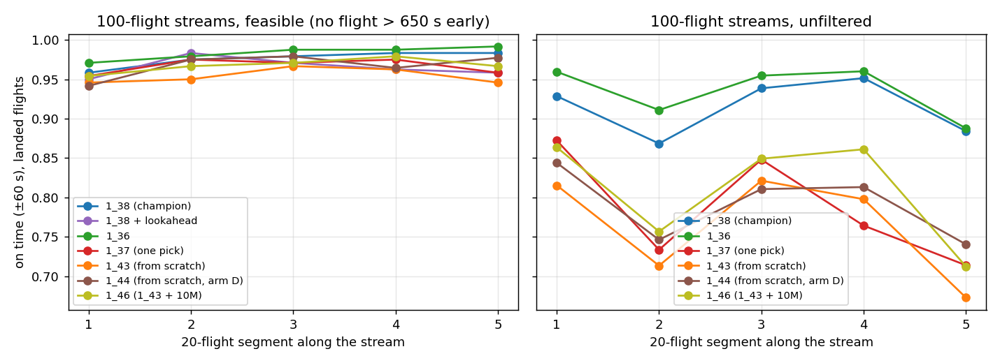

# Long streams

!!! abstract "Summary"
    Flown on 60- and 100-flight streams (three and five 20-flight waves), nine agents fly **every
    feasible stream without a single loss of separation**: the champion `1_38`, the rest of its
    lineage from `1_34` on (`1_35`, `1_36`, `1_37`, `1_39`), the curriculum run `1_43` and the hard-solved
    fine-tunes `1_47` and `1_48`. Precision does not drift along the stream. A feasible stream is one
    where no flight needs more than the generator's own 650 s cap of delay. The other seven agents
    tested each lose separation on one to six of the 39 feasible streams: `1_32` and `1_33`, from
    before the lexicographic objective, and the from-scratch arms A, B and D and `1_46`. On
    unfiltered streams the losses come back, and they sit in the waves that are over capacity.
    Feasible long streams are rare in generated traffic: 4.5% at 60 flights, 0.5% at 100.

Data: `analysis/2026-09-27_scratch/longstreams/` in the code repo (`report.md`, `eval/`, `seeds/`).
Screening: `analysis/long_stream_seeds.py`. Scoring: `score_windowed.py --seed-file --flights-csv`.
Table and plot: `analysis/long_stream_report.py`. Models: [`1_38`](../models/1_38.md) (champion),
[`1_36`](../models/1_36.md), [`1_37`](../models/1_37.md) (one pick), the from-scratch
[`1_43`](../models/1_43.md) and [`1_44`](../models/1_44.md), and [`1_46`](../models/1_46.md)
(`1_43` + 10M); all deterministic.

## Method

- **Streams:** stitched 3×20 = 60 and 5×20 = 100 flights, with a 600–900 s (10–15 min) gap
  between waves ([stitched streams](../how/environments.md#stitching)). Stream seeds come from a
  fixed generator and are never among the 100 validation seeds.
- **Feasible:** flown do-nothing, no flight is predicted more than **650 s early** anywhere in the
  stream. 650 s is the scenario generator's own cap on the delay a flight may need.
- **Unfiltered:** the first 40 candidate streams of each length, as generated.

**Feasible long streams are rare.**

| stream | candidates | feasible | largest early arrival: median / 90th pct / max |
|---|---|---|---|
| 60 flights | 600 | **27 (4.5%)** | 1 210 / 1 735 / 2 599 s |
| 100 flights | 2 500 | **12 (0.5%)** | 1 359 / 1 859 / 2 679 s |

The 100-flight feasible set is only 12 streams: a small sample, so read its rates loosely.

## Results

Counts are streams; "on time" is the share of flights within ±60 s of their AMAN target. The table
is generated from the evaluation files (`longstreams/eval/`, every stream run to its own horizon)
and lists every agent flown on long streams so far; agents not yet flown are named below it.

<!-- gen:longstreams models=all -->

<table class="tada-table tada-bands"><thead><tr><th>stream</th><th>n</th><th>model</th><th>no loss of separation</th><th>solved (±60 s)</th><th>hard-solved (±30 s)</th><th>on time, all flights</th><th>on time, landed</th><th>mean |dev|, landed</th><th>clearances / flight</th></tr></thead><tbody><tr class="tada-band-first"><td>60 flights, feasible</td><td>27</td><td><a href="../../models/1_32/">1_32</a></td><td>23</td><td>3</td><td>0</td><td>0.872</td><td>0.965</td><td>15 s</td><td>5.9</td></tr><tr><td></td><td></td><td><a href="../../models/1_33/">1_33</a></td><td>26</td><td>0</td><td>0</td><td>0.893</td><td>0.921</td><td>20 s</td><td>6.5</td></tr><tr><td></td><td></td><td><a href="../../models/1_34/">1_34</a></td><td><strong>27</strong></td><td>1</td><td>0</td><td>0.949</td><td>0.949</td><td>18 s</td><td>6.7</td></tr><tr><td></td><td></td><td><a href="../../models/1_35/">1_35</a></td><td><strong>27</strong></td><td>3</td><td>0</td><td>0.959</td><td>0.959</td><td>13 s</td><td>4.7</td></tr><tr><td></td><td></td><td><a href="../../models/1_36/">1_36</a></td><td><strong>27</strong></td><td>9</td><td>1</td><td>0.985</td><td>0.985</td><td>9 s</td><td>6.5</td></tr><tr><td></td><td></td><td><a href="../../models/1_37/">1_37</a></td><td><strong>27</strong></td><td>4</td><td>0</td><td>0.976</td><td>0.976</td><td>16 s</td><td>3.6</td></tr><tr><td></td><td></td><td><a href="../../models/1_38/">1_38</a></td><td><strong>27</strong></td><td>11</td><td>1</td><td>0.986</td><td>0.986</td><td>9 s</td><td>5.7</td></tr><tr><td></td><td></td><td><a href="../../models/1_39/">1_39</a></td><td><strong>27</strong></td><td>4</td><td>0</td><td>0.964</td><td>0.964</td><td>13 s</td><td>6.2</td></tr><tr><td></td><td></td><td><a href="../../models/1_40/">1_40</a></td><td>26</td><td>1</td><td>0</td><td>0.923</td><td>0.933</td><td>20 s</td><td>8.4</td></tr><tr><td></td><td></td><td><a href="../../models/1_41/">1_41</a></td><td><strong>27</strong></td><td>3</td><td>0</td><td>0.946</td><td>0.946</td><td>18 s</td><td>8.5</td></tr><tr><td></td><td></td><td><a href="../../models/1_42/">1_42</a></td><td><strong>27</strong></td><td>0</td><td>0</td><td>0.922</td><td>0.922</td><td>19 s</td><td>6.8</td></tr><tr><td></td><td></td><td><a href="../../models/1_43/">1_43</a></td><td><strong>27</strong></td><td>1</td><td>0</td><td>0.952</td><td>0.952</td><td>15 s</td><td>6.9</td></tr><tr><td></td><td></td><td><a href="../../models/1_44/">1_44</a></td><td>26</td><td>8</td><td>0</td><td>0.949</td><td>0.973</td><td>12 s</td><td>7.5</td></tr><tr><td></td><td></td><td><a href="../../models/1_46/">1_46</a></td><td>26</td><td>5</td><td>0</td><td>0.947</td><td>0.974</td><td>10 s</td><td>8.4</td></tr><tr><td></td><td></td><td><a href="../../models/1_47/">1_47</a></td><td><strong>27</strong></td><td>2</td><td>0</td><td>0.967</td><td>0.967</td><td>12 s</td><td>9.7</td></tr><tr><td></td><td></td><td><a href="../../models/1_48/">1_48</a></td><td><strong>27</strong></td><td>7</td><td>0</td><td>0.977</td><td>0.977</td><td>8 s</td><td>8.4</td></tr><tr class="tada-band-first"><td>60 flights, unfiltered</td><td>40</td><td><a href="../../models/1_32/">1_32</a></td><td>13</td><td>0</td><td>0</td><td>0.538</td><td>0.835</td><td>57 s</td><td>3.8</td></tr><tr><td></td><td></td><td><a href="../../models/1_33/">1_33</a></td><td>22</td><td>0</td><td>0</td><td>0.580</td><td>0.804</td><td>73 s</td><td>4.3</td></tr><tr><td></td><td></td><td><a href="../../models/1_34/">1_34</a></td><td>24</td><td>1</td><td>0</td><td>0.623</td><td>0.820</td><td>69 s</td><td>4.6</td></tr><tr><td></td><td></td><td><a href="../../models/1_35/">1_35</a></td><td>31</td><td>1</td><td>0</td><td>0.738</td><td>0.824</td><td>64 s</td><td>4.3</td></tr><tr><td></td><td></td><td><a href="../../models/1_36/">1_36</a></td><td>31</td><td>6</td><td>0</td><td>0.798</td><td>0.930</td><td>28 s</td><td>6.1</td></tr><tr><td></td><td></td><td><a href="../../models/1_37/">1_37</a></td><td>34</td><td>1</td><td>0</td><td>0.748</td><td>0.819</td><td>73 s</td><td>3.7</td></tr><tr><td></td><td></td><td><a href="../../models/1_38/">1_38</a></td><td>34</td><td>7</td><td>0</td><td>0.836</td><td>0.914</td><td>39 s</td><td>5.8</td></tr><tr><td></td><td></td><td><a href="../../models/1_39/">1_39</a></td><td>34</td><td>1</td><td>0</td><td>0.767</td><td>0.840</td><td>55 s</td><td>5.5</td></tr><tr><td></td><td></td><td><a href="../../models/1_40/">1_40</a></td><td>31</td><td>0</td><td>0</td><td>0.667</td><td>0.773</td><td>86 s</td><td>6.8</td></tr><tr><td></td><td></td><td><a href="../../models/1_41/">1_41</a></td><td>29</td><td>0</td><td>0</td><td>0.607</td><td>0.760</td><td>69 s</td><td>6.2</td></tr><tr><td></td><td></td><td><a href="../../models/1_42/">1_42</a></td><td>33</td><td>0</td><td>0</td><td>0.675</td><td>0.746</td><td>91 s</td><td>6.5</td></tr><tr><td></td><td></td><td><a href="../../models/1_43/">1_43</a></td><td>35</td><td>0</td><td>0</td><td>0.755</td><td>0.793</td><td>95 s</td><td>6.6</td></tr><tr><td></td><td></td><td><a href="../../models/1_44/">1_44</a></td><td>31</td><td>0</td><td>0</td><td>0.693</td><td>0.792</td><td>85 s</td><td>6.4</td></tr><tr><td></td><td></td><td><a href="../../models/1_46/">1_46</a></td><td>36</td><td>1</td><td>0</td><td>0.781</td><td>0.833</td><td>69 s</td><td>7.4</td></tr><tr><td></td><td></td><td><a href="../../models/1_47/">1_47</a></td><td>33</td><td>0</td><td>0</td><td>0.772</td><td>0.847</td><td>69 s</td><td>7.8</td></tr><tr><td></td><td></td><td><a href="../../models/1_48/">1_48</a></td><td>34</td><td>0</td><td>0</td><td>0.755</td><td>0.826</td><td>71 s</td><td>6.9</td></tr><tr class="tada-band-first"><td>100 flights, feasible</td><td>12</td><td><a href="../../models/1_32/">1_32</a></td><td>10</td><td>0</td><td>0</td><td>0.867</td><td>0.965</td><td>15 s</td><td>5.8</td></tr><tr><td></td><td></td><td><a href="../../models/1_33/">1_33</a></td><td><strong>12</strong></td><td>0</td><td>0</td><td>0.928</td><td>0.928</td><td>20 s</td><td>6.8</td></tr><tr><td></td><td></td><td><a href="../../models/1_34/">1_34</a></td><td><strong>12</strong></td><td>0</td><td>0</td><td>0.953</td><td>0.953</td><td>19 s</td><td>6.7</td></tr><tr><td></td><td></td><td><a href="../../models/1_35/">1_35</a></td><td><strong>12</strong></td><td>0</td><td>0</td><td>0.961</td><td>0.961</td><td>13 s</td><td>4.5</td></tr><tr><td></td><td></td><td><a href="../../models/1_36/">1_36</a></td><td><strong>12</strong></td><td>1</td><td>0</td><td>0.983</td><td>0.983</td><td>9 s</td><td>6.4</td></tr><tr><td></td><td></td><td><a href="../../models/1_37/">1_37</a></td><td><strong>12</strong></td><td>0</td><td>0</td><td>0.967</td><td>0.967</td><td>16 s</td><td>3.6</td></tr><tr><td></td><td></td><td><a href="../../models/1_38/">1_38</a></td><td><strong>12</strong></td><td>0</td><td>0</td><td>0.976</td><td>0.976</td><td>10 s</td><td>5.6</td></tr><tr><td></td><td></td><td><a href="../../models/1_38/">1_38</a> + lookahead</td><td><strong>12</strong></td><td>2</td><td>0</td><td>0.965</td><td>0.965</td><td>15 s</td><td>6.0</td></tr><tr><td></td><td></td><td><a href="../../models/1_39/">1_39</a></td><td><strong>12</strong></td><td>1</td><td>0</td><td>0.952</td><td>0.952</td><td>15 s</td><td>6.1</td></tr><tr><td></td><td></td><td><a href="../../models/1_40/">1_40</a></td><td>11</td><td>0</td><td>0</td><td>0.868</td><td>0.916</td><td>22 s</td><td>8.0</td></tr><tr><td></td><td></td><td><a href="../../models/1_41/">1_41</a></td><td>11</td><td>0</td><td>0</td><td>0.883</td><td>0.936</td><td>19 s</td><td>7.9</td></tr><tr><td></td><td></td><td><a href="../../models/1_42/">1_42</a></td><td>11</td><td>0</td><td>0</td><td>0.864</td><td>0.929</td><td>19 s</td><td>5.8</td></tr><tr><td></td><td></td><td><a href="../../models/1_43/">1_43</a></td><td><strong>12</strong></td><td>0</td><td>0</td><td>0.954</td><td>0.954</td><td>14 s</td><td>6.7</td></tr><tr><td></td><td></td><td><a href="../../models/1_44/">1_44</a></td><td>11</td><td>0</td><td>0</td><td>0.939</td><td>0.967</td><td>13 s</td><td>8.3</td></tr><tr><td></td><td></td><td><a href="../../models/1_46/">1_46</a></td><td><strong>12</strong></td><td>0</td><td>0</td><td>0.967</td><td>0.968</td><td>12 s</td><td>8.7</td></tr><tr><td></td><td></td><td><a href="../../models/1_47/">1_47</a></td><td><strong>12</strong></td><td>1</td><td>0</td><td>0.967</td><td>0.968</td><td>13 s</td><td>9.6</td></tr><tr><td></td><td></td><td><a href="../../models/1_48/">1_48</a></td><td><strong>12</strong></td><td>0</td><td>0</td><td>0.975</td><td>0.975</td><td>8 s</td><td>8.4</td></tr><tr class="tada-band-first"><td>100 flights, unfiltered</td><td>40</td><td><a href="../../models/1_32/">1_32</a></td><td>8</td><td>0</td><td>0</td><td>0.436</td><td>0.820</td><td>71 s</td><td>3.1</td></tr><tr><td></td><td></td><td><a href="../../models/1_33/">1_33</a></td><td>11</td><td>0</td><td>0</td><td>0.445</td><td>0.773</td><td>89 s</td><td>3.4</td></tr><tr><td></td><td></td><td><a href="../../models/1_34/">1_34</a></td><td>14</td><td>0</td><td>0</td><td>0.530</td><td>0.818</td><td>72 s</td><td>4.0</td></tr><tr><td></td><td></td><td><a href="../../models/1_35/">1_35</a></td><td>23</td><td>0</td><td>0</td><td>0.655</td><td>0.811</td><td>70 s</td><td>4.0</td></tr><tr><td></td><td></td><td><a href="../../models/1_36/">1_36</a></td><td>25</td><td>2</td><td>0</td><td>0.730</td><td>0.936</td><td>26 s</td><td>5.7</td></tr><tr><td></td><td></td><td><a href="../../models/1_37/">1_37</a></td><td>24</td><td>0</td><td>0</td><td>0.662</td><td>0.791</td><td>81 s</td><td>3.5</td></tr><tr><td></td><td></td><td><a href="../../models/1_38/">1_38</a></td><td>30</td><td>1</td><td>0</td><td>0.812</td><td>0.915</td><td>43 s</td><td>5.8</td></tr><tr><td></td><td></td><td><a href="../../models/1_39/">1_39</a></td><td>28</td><td>0</td><td>0</td><td>0.708</td><td>0.825</td><td>62 s</td><td>5.1</td></tr><tr><td></td><td></td><td><a href="../../models/1_40/">1_40</a></td><td>17</td><td>0</td><td>0</td><td>0.531</td><td>0.763</td><td>86 s</td><td>5.5</td></tr><tr><td></td><td></td><td><a href="../../models/1_41/">1_41</a></td><td>26</td><td>0</td><td>0</td><td>0.667</td><td>0.778</td><td>80 s</td><td>6.5</td></tr><tr><td></td><td></td><td><a href="../../models/1_42/">1_42</a></td><td>24</td><td>0</td><td>0</td><td>0.605</td><td>0.737</td><td>98 s</td><td>5.6</td></tr><tr><td></td><td></td><td><a href="../../models/1_43/">1_43</a></td><td>28</td><td>0</td><td>0</td><td>0.659</td><td>0.767</td><td>103 s</td><td>5.9</td></tr><tr><td></td><td></td><td><a href="../../models/1_44/">1_44</a></td><td>22</td><td>0</td><td>0</td><td>0.582</td><td>0.794</td><td>88 s</td><td>5.3</td></tr><tr><td></td><td></td><td><a href="../../models/1_46/">1_46</a></td><td>29</td><td>0</td><td>0</td><td>0.741</td><td>0.811</td><td>77 s</td><td>7.0</td></tr><tr><td></td><td></td><td><a href="../../models/1_47/">1_47</a></td><td>29</td><td>0</td><td>0</td><td>0.735</td><td>0.837</td><td>72 s</td><td>7.4</td></tr><tr><td></td><td></td><td><a href="../../models/1_48/">1_48</a></td><td>28</td><td>1</td><td>0</td><td>0.699</td><td>0.826</td><td>74 s</td><td>6.4</td></tr></tbody></table>

Not yet flown on long streams: `1_31`, `1_50`, `1_51`, `1_54`, `1_55`, `1_58`, `1_61`, `1_63`, `1_65`, `1_68`, `1_70`, `1_72`, `1_74`, `1_76`, `1_78`, `1_82`, `1_101` ([backfill](../backfill.md)).

<!-- /gen -->

- **The champion's lineage flies feasible streams safely.** `1_38`, `1_36`, `1_37` and `1_43` fly all
  of them without a loss, and every flight lands. The reselection models put 98–99% of flights on
  time, 9–10 s off on average; the one-pick control about 97%, 16 s off. `1_34`, `1_35` and `1_39` are
  also loss-free on all 39. The two earliest agents are not: `1_32` loses 6 (4 at 60 flights, 2 at 100),
  `1_33` loses 1.
- **The last training stage matters within a lineage, but stitched training alone is not enough.**
  `1_44` (arm D) loses separation on one feasible 60-flight and one feasible 100-flight stream, and
  `1_46` (`1_43` continued on 20-flight streams) on one feasible 60-flight stream. Both last trained
  on 20-flight streams only, and both are more precise than `1_43` on the 20-flight validation seeds
  ([Training from scratch](curriculum.md)). Fine-tuned on stitched streams, `1_47` (from `1_44`) and
  `1_48` (from `1_46`) lose none. But arms A and B (`1_40`, `1_41`, `1_42`) trained on stitched
  2×20 streams throughout and still lose one or two feasible streams each. Every one of these
  differences is one or two streams out of 39, too few to be significant on its own.
- **Unfiltered streams lose separation, in the over-capacity waves.** `1_38` loses separation on 6
  of 40 60-flight streams and 10 of 40 100-flight streams, after a median of 27 and 57 landed
  flights. The one-pick `1_37` loses 16 of 40 at 100 flights, and its precision among landed flights
  falls to 0.791 against `1_38`'s 0.915.
- **The from-scratch `1_43` is as safe as the champion on long streams, but less precise.** It
  flies every feasible stream without a loss and loses about as many unfiltered streams as `1_38`,
  but lands fewer flights on time, most clearly on unfiltered streams. `1_46` keeps unfiltered
  streams clean about as often as `1_38` (36 and 29 of 40) with lower precision. Among the
  from-scratch agents and their fine-tunes, `1_40` loses the most unfiltered 100-flight streams
  (23 of 40), then `1_44` (18). The early `1_32`–`1_34` lose the most of all (26–32 of 40).
- **Reselection costs clearances.** On feasible 100-flight streams the one-pick control `1_37` issues
  3.6 per flight, against 5.6 for `1_38` and 6.4 for `1_36`, trained the same way with reselection.
  The from-scratch agents and their fine-tunes issue 5.8–9.6, the most for `1_47`. The earlier
  one-pick agents `1_32`–`1_35` issue 4.5–6.8, so one pick alone does not make an agent frugal.
- **Lookahead** on feasible 100-flight streams solved 2 of 12 strictly, against 0 without; its
  on-time rate is slightly lower.

## Feasible 40-flight streams (feas40, test51) { #feasible-2x20 }

The stitched 2×20 validation set can't serve as a feasible benchmark, because only 8 of its 100
streams pass the filter. Two feasible sets of 40-flight streams (two 20-flight scenarios, a random
120–900 s cooling gap) were drawn instead: 800 candidates, of which 91 (11.4%) pass the same
650 s criterion. The first 40 are **feas40**, scored every 1M steps by the trackers of the
hard-solved fine-tunes. The other 51 are **test51**, held out to confirm a checkpoint picked on
its feas40 score, since picking on feas40 biases that score. Deterministic, frame pinned, each
stream run to its own horizon.

<!-- gen:feasible-2x20 models=all -->
<table class="tada-table tada-bands"><thead><tr><th>set</th><th>model</th><th>solved (±60 s)</th><th>hard-solved (±30 s)</th><th>separation lost</th><th>on time</th></tr></thead><tbody><tr class="tada-band-first"><td>feas40: 40 feasible 2×20 streams</td><td><a href="../../models/1_32/">1_32</a></td><td>12</td><td>0</td><td>4</td><td>0.904</td></tr><tr><td></td><td><a href="../../models/1_33/">1_33</a></td><td>2</td><td>0</td><td>2</td><td>0.899</td></tr><tr><td></td><td><a href="../../models/1_34/">1_34</a></td><td>8</td><td>0</td><td>2</td><td>0.917</td></tr><tr><td></td><td><a href="../../models/1_35/">1_35</a></td><td>7</td><td>0</td><td>1</td><td>0.939</td></tr><tr><td></td><td><a href="../../models/1_36/">1_36</a></td><td>23</td><td>4</td><td>0</td><td>0.986</td></tr><tr><td></td><td><a href="../../models/1_37/">1_37</a></td><td>17</td><td>0</td><td>0</td><td>0.976</td></tr><tr><td></td><td><a href="../../models/1_38/">1_38</a></td><td>22</td><td>4</td><td>0</td><td>0.984</td></tr><tr><td></td><td><a href="../../models/1_38/">1_38</a> + lookahead</td><td>13</td><td>0</td><td>0</td><td>0.964</td></tr><tr><td></td><td><a href="../../models/1_39/">1_39</a></td><td>12</td><td>0</td><td>0</td><td>0.959</td></tr><tr><td></td><td><a href="../../models/1_40/">1_40</a></td><td>6</td><td>0</td><td>0</td><td>0.933</td></tr><tr><td></td><td><a href="../../models/1_41/">1_41</a></td><td>4</td><td>0</td><td>0</td><td>0.936</td></tr><tr><td></td><td><a href="../../models/1_42/">1_42</a></td><td>3</td><td>0</td><td>1</td><td>0.920</td></tr><tr><td></td><td><a href="../../models/1_43/">1_43</a></td><td>6</td><td>0</td><td>0</td><td>0.957</td></tr><tr><td></td><td><a href="../../models/1_44/">1_44</a></td><td>16</td><td>1</td><td>0</td><td>0.964</td></tr><tr><td></td><td><a href="../../models/1_46/">1_46</a></td><td>18</td><td>5</td><td>1</td><td>0.969</td></tr><tr><td></td><td><a href="../../models/1_47/">1_47</a></td><td>14</td><td>6</td><td>0</td><td>0.966</td></tr><tr><td></td><td><a href="../../models/1_47/">1_47</a> + lookahead</td><td>16</td><td>1</td><td>0</td><td>0.980</td></tr><tr><td></td><td><a href="../../models/1_48/">1_48</a></td><td>21</td><td>5</td><td>0</td><td>0.981</td></tr><tr><td></td><td><a href="../../models/1_48/">1_48</a> + lookahead</td><td>8</td><td>3</td><td>0</td><td>0.958</td></tr><tr><td></td><td><a href="../../models/1_50/">1_50</a></td><td>14</td><td>6</td><td>1</td><td>0.965</td></tr><tr><td></td><td><a href="../../models/1_50/">1_50</a> + lookahead</td><td>4</td><td>1</td><td>3</td><td>0.893</td></tr><tr><td></td><td><a href="../../models/1_51/">1_51</a></td><td>7</td><td>3</td><td>0</td><td>0.956</td></tr><tr><td></td><td><a href="../../models/1_51/">1_51</a> + lookahead</td><td>8</td><td>1</td><td>0</td><td>0.946</td></tr><tr class="tada-band-first"><td>test51: 51 held-out feasible 2×20 streams</td><td><a href="../../models/1_32/">1_32</a></td><td>10</td><td>0</td><td>5</td><td>0.906</td></tr><tr><td></td><td><a href="../../models/1_33/">1_33</a></td><td>1</td><td>0</td><td>1</td><td>0.911</td></tr><tr><td></td><td><a href="../../models/1_34/">1_34</a></td><td>9</td><td>0</td><td>1</td><td>0.937</td></tr><tr><td></td><td><a href="../../models/1_35/">1_35</a></td><td>9</td><td>1</td><td>0</td><td>0.960</td></tr><tr><td></td><td><a href="../../models/1_36/">1_36</a></td><td>22</td><td>4</td><td>0</td><td>0.982</td></tr><tr><td></td><td><a href="../../models/1_37/">1_37</a></td><td>16</td><td>0</td><td>0</td><td>0.973</td></tr><tr><td></td><td><a href="../../models/1_38/">1_38</a></td><td>25</td><td>5</td><td>0</td><td>0.982</td></tr><tr><td></td><td><a href="../../models/1_39/">1_39</a></td><td>12</td><td>1</td><td>0</td><td>0.963</td></tr><tr><td></td><td><a href="../../models/1_40/">1_40</a></td><td>4</td><td>0</td><td>1</td><td>0.916</td></tr><tr><td></td><td><a href="../../models/1_41/">1_41</a></td><td>6</td><td>0</td><td>0</td><td>0.929</td></tr><tr><td></td><td><a href="../../models/1_42/">1_42</a></td><td>3</td><td>0</td><td>2</td><td>0.885</td></tr><tr><td></td><td><a href="../../models/1_43/">1_43</a></td><td>5</td><td>1</td><td>0</td><td>0.948</td></tr><tr><td></td><td><a href="../../models/1_44/">1_44</a></td><td>15</td><td>1</td><td>0</td><td>0.966</td></tr><tr><td></td><td><a href="../../models/1_46/">1_46</a></td><td>17</td><td>1</td><td>1</td><td>0.956</td></tr><tr><td></td><td><a href="../../models/1_47/">1_47</a></td><td>10</td><td>3</td><td>0</td><td>0.965</td></tr><tr><td></td><td><a href="../../models/1_48/">1_48</a></td><td>21</td><td>6</td><td>1</td><td>0.970</td></tr><tr><td></td><td><a href="../../models/1_50/">1_50</a></td><td>16</td><td>5</td><td>2</td><td>0.940</td></tr><tr><td></td><td><a href="../../models/1_51/">1_51</a></td><td>9</td><td>2</td><td>0</td><td>0.947</td></tr></tbody></table>

<!-- /gen -->

## No drift along the stream

On time among landed flights, by 20-flight wave:

**Feasible 100-flight streams:**

<!-- gen:longstream-waves models=all stream=ls_k5_feasible -->
<table class="tada-table"><thead><tr><th>model</th><th>wave 1</th><th>wave 2</th><th>wave 3</th><th>wave 4</th><th>wave 5</th></tr></thead><tbody><tr><td><a href="../../models/1_32/">1_32</a></td><td>0.944</td><td>0.964</td><td>0.982</td><td>0.971</td><td>0.965</td></tr><tr><td><a href="../../models/1_33/">1_33</a></td><td>0.921</td><td>0.900</td><td>0.963</td><td>0.929</td><td>0.929</td></tr><tr><td><a href="../../models/1_34/">1_34</a></td><td>0.938</td><td>0.938</td><td>0.979</td><td>0.954</td><td>0.954</td></tr><tr><td><a href="../../models/1_35/">1_35</a></td><td>0.942</td><td>0.971</td><td>0.971</td><td>0.954</td><td>0.967</td></tr><tr><td><a href="../../models/1_36/">1_36</a></td><td>0.971</td><td>0.979</td><td>0.988</td><td>0.988</td><td>0.992</td></tr><tr><td><a href="../../models/1_37/">1_37</a></td><td>0.954</td><td>0.975</td><td>0.971</td><td>0.975</td><td>0.958</td></tr><tr><td><a href="../../models/1_38/">1_38</a></td><td>0.958</td><td>0.975</td><td>0.979</td><td>0.983</td><td>0.983</td></tr><tr><td><a href="../../models/1_39/">1_39</a></td><td>0.954</td><td>0.925</td><td>0.958</td><td>0.958</td><td>0.963</td></tr><tr><td><a href="../../models/1_40/">1_40</a></td><td>0.850</td><td>0.941</td><td>0.941</td><td>0.918</td><td>0.936</td></tr><tr><td><a href="../../models/1_41/">1_41</a></td><td>0.904</td><td>0.931</td><td>0.950</td><td>0.941</td><td>0.955</td></tr><tr><td><a href="../../models/1_42/">1_42</a></td><td>0.919</td><td>0.945</td><td>0.936</td><td>0.882</td><td>0.964</td></tr><tr><td><a href="../../models/1_43/">1_43</a></td><td>0.946</td><td>0.950</td><td>0.967</td><td>0.963</td><td>0.946</td></tr><tr><td><a href="../../models/1_44/">1_44</a></td><td>0.942</td><td>0.975</td><td>0.979</td><td>0.964</td><td>0.977</td></tr><tr><td><a href="../../models/1_46/">1_46</a></td><td>0.954</td><td>0.967</td><td>0.971</td><td>0.979</td><td>0.967</td></tr><tr><td><a href="../../models/1_47/">1_47</a></td><td>0.950</td><td>0.963</td><td>0.979</td><td>0.971</td><td>0.975</td></tr><tr><td><a href="../../models/1_48/">1_48</a></td><td>0.963</td><td>0.979</td><td>0.988</td><td>0.963</td><td>0.983</td></tr></tbody></table>

On time among landed flights, by 20-flight wave (100 flights, feasible).

<!-- /gen -->

**Unfiltered 100-flight streams:**

<!-- gen:longstream-waves models=all stream=ls_k5_all -->
<table class="tada-table"><thead><tr><th>model</th><th>wave 1</th><th>wave 2</th><th>wave 3</th><th>wave 4</th><th>wave 5</th></tr></thead><tbody><tr><td><a href="../../models/1_32/">1_32</a></td><td>0.852</td><td>0.768</td><td>0.884</td><td>0.808</td><td>0.749</td></tr><tr><td><a href="../../models/1_33/">1_33</a></td><td>0.802</td><td>0.762</td><td>0.804</td><td>0.759</td><td>0.688</td></tr><tr><td><a href="../../models/1_34/">1_34</a></td><td>0.835</td><td>0.747</td><td>0.836</td><td>0.829</td><td>0.864</td></tr><tr><td><a href="../../models/1_35/">1_35</a></td><td>0.870</td><td>0.795</td><td>0.840</td><td>0.776</td><td>0.754</td></tr><tr><td><a href="../../models/1_36/">1_36</a></td><td>0.960</td><td>0.911</td><td>0.955</td><td>0.960</td><td>0.888</td></tr><tr><td><a href="../../models/1_37/">1_37</a></td><td>0.872</td><td>0.734</td><td>0.848</td><td>0.764</td><td>0.714</td></tr><tr><td><a href="../../models/1_38/">1_38</a></td><td>0.929</td><td>0.868</td><td>0.939</td><td>0.951</td><td>0.884</td></tr><tr><td><a href="../../models/1_39/">1_39</a></td><td>0.875</td><td>0.781</td><td>0.832</td><td>0.862</td><td>0.766</td></tr><tr><td><a href="../../models/1_40/">1_40</a></td><td>0.783</td><td>0.734</td><td>0.805</td><td>0.797</td><td>0.681</td></tr><tr><td><a href="../../models/1_41/">1_41</a></td><td>0.809</td><td>0.691</td><td>0.826</td><td>0.854</td><td>0.709</td></tr><tr><td><a href="../../models/1_42/">1_42</a></td><td>0.789</td><td>0.700</td><td>0.760</td><td>0.765</td><td>0.647</td></tr><tr><td><a href="../../models/1_43/">1_43</a></td><td>0.815</td><td>0.714</td><td>0.821</td><td>0.798</td><td>0.673</td></tr><tr><td><a href="../../models/1_44/">1_44</a></td><td>0.844</td><td>0.746</td><td>0.811</td><td>0.813</td><td>0.741</td></tr><tr><td><a href="../../models/1_46/">1_46</a></td><td>0.864</td><td>0.757</td><td>0.849</td><td>0.861</td><td>0.713</td></tr><tr><td><a href="../../models/1_47/">1_47</a></td><td>0.875</td><td>0.772</td><td>0.867</td><td>0.906</td><td>0.759</td></tr><tr><td><a href="../../models/1_48/">1_48</a></td><td>0.882</td><td>0.777</td><td>0.877</td><td>0.881</td><td>0.692</td></tr></tbody></table>

On time among landed flights, by 20-flight wave (100 flights, unfiltered).

<!-- /gen -->

On feasible streams precision does not decay; if anything it rises after the first wave. On
unfiltered streams it dips in the waves that carry over-capacity traffic and recovers after
them; the one-pick control recovers less.

## Why strict solves are rare

Solving a long stream means every one of 60 or 100 flights within ±60 s. For `1_38` that is 11 of
27 feasible 60-flight streams and 0 of 12 at 100 flights, which is what its per-flight precision
predicts. If each flight is on time independently with probability 0.986, all 60 are on time in
0.986⁶⁰ ≈ 43% of streams (observed 11 of 27 = 41%), and all 100 at 0.976 in 0.976¹⁰⁰ ≈ 9%
(observed 0 of 12, about one expected). Strict solves are rare because one or two misses in 60–100
flights are enough to fail, not because precision decays along the stream (see the wave table).

!!! note "An evaluation bug, found and fixed"
    A first scoring of these streams (and of the stitched 2×20 validation battery) stopped
    episodes early: the scorer capped a stream at `max(200, 7 × flights × segments)` steps, below
    the environment's own `200 × segments`. On 13 of 27 feasible 60-flight streams and 7 of 12
    100-flight streams it cut the stream off before its last landing, and those flights counted as
    late. It surfaced because a render, which ran to the natural end, did not match its score.
    Since commit `8dd6539` evaluation runs to each stream's own horizon, records a `horizon_capped`
    column and warns if any episode is still cut off. Every number on this site is from the
    rescored files. On the 20-flight evaluations the cap never bound.

## Renders

All by `1_38`, deterministic, 100-flight streams.

The feasible stream it flies best:

<!-- gen:render file=1_38_k5_best_seed868278894.mp4 -->
<figure class="tada-render" title="metadata: analysis/2026-09-27_scratch/longstreams/renders/1_38_k5_best_seed868278894_solutions.json · file verified identical">
<video controls preload="metadata" src="../../assets/renders/1_38_k5_best_seed868278894.mp4"></video>
<figcaption>Rendered by 1_38 (final_model.zip) · seed 868278894 · 5×20-flight stitched stream, feasible, gaps 600–900 s · deterministic · 99 of 100 on time, worst 66 s, 568 clearances</figcaption>
</figure>
<!-- /gen -->

The feasible stream at its median on-time rate:

<!-- gen:render file=1_38_k5_typical_seed1417723440.mp4 -->
<figure class="tada-render" title="metadata: analysis/2026-09-27_scratch/longstreams/renders/1_38_k5_typical_seed1417723440_solutions.json · file verified identical">
<video controls preload="metadata" src="../../assets/renders/1_38_k5_typical_seed1417723440.mp4"></video>
<figcaption>Rendered by 1_38 (final_model.zip) · seed 1417723440 · 5×20-flight stitched stream, feasible, gaps 600–900 s · deterministic · 98 of 100 on time, worst 85 s, 608 clearances</figcaption>
</figure>
<!-- /gen -->

An unfiltered stream on which it loses separation:

<!-- gen:render file=1_38_k5_loss_seed1357624909.mp4 -->
<figure class="tada-render" title="metadata: analysis/2026-09-27_scratch/longstreams/renders/1_38_k5_loss_seed1357624909_solutions.json · file verified identical">
<video controls preload="metadata" src="../../assets/renders/1_38_k5_loss_seed1357624909.mp4"></video>
<figcaption>Rendered by 1_38 (final_model.zip) · seed 1357624909 · 5×20-flight stitched stream, unfiltered, gaps 600–900 s · deterministic · 76 of 100 on time, loss of separation at step 527, 645 clearances</figcaption>
</figure>
<!-- /gen -->

What makes a wave over capacity, and the validation seeds no agent has ever flown safely:
[Over-capacity scenarios](capacity.md).
