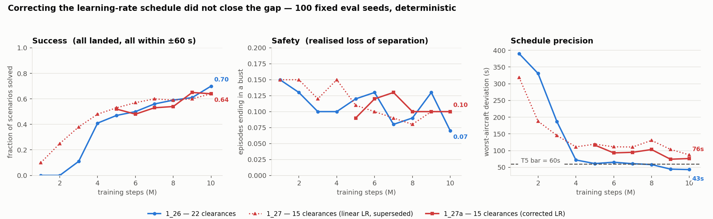

# TADA Single-Agent RL

!!! abstract "TL;DR"
    A single RL agent sequences up to 10 inbound aircraft into Milan Malpensa, issuing one
    clearance per 45 s to hit AMAN target landing times without losing separation.

    **Current best — run `1_26`, 22 clearances, scored on 100 fixed seeds:** success **0.70**,
    losses of separation **0.07**, worst-aircraft deviation **43 s**. The clean-subset success
    rate that had held near 53.7% across twenty runs reached **0.753**.

    **Run `1_27` tested a reduced 15-clearance set on top and did not beat it** — success
    **0.64**, a statistical tie, but worst-aircraft deviation nearly doubled, to **87 s**. It
    learns much faster and converges worse. A mid-run crash had changed its learning-rate
    schedule; **`1_27a` re-ran the second half on the correct one and the result held** — same
    0.64 success, deviation 76 s, and no gain at all among clean episodes. The reduced set issues
    `SHORTEN_TROMBONE`, its one new capability, about **once per thousand clearances** in both
    runs. See [22 clearances vs 15](analysis_v1_v2.md).

    **A second track, [20-flight streams](#windowed-track)**, builds on this agent: a 20-flight
    trombone stream seen through a window of the next 10 flights to land. Best so far: `1_33`,
    75% of flights on time, and all 20 on time in **44% of scenarios in at least one of 10
    attempts**. Most remaining separation losses sit in scenarios that need more delay than
    the airspace can absorb. `1_34` (in progress) trains on a lexicographic objective: safety,
    then each flight's deviation bracket, then the fewest actions.

    **Read numbers only from `analysis/track_run.py`.** The in-training `success_rate` is a
    5-episode rolling window and reported 1.00 for a run whose true rate was 0.38.



- **Algorithm:** PPO with a custom autoregressive policy (`ATCAutoregressivePolicy`) — aircraft
  head → clearance head conditioned on the sampled aircraft, masks read from the observation.
  See [Training](training.md).
- **Simulator:** Rust `flight_simulator` (PyO3 wheel), driven through a deterministic rollout.
- **Scenario:** MXP trombone (`VALIDATION_USE_CASE_1`). BGY point-merge exists but underperforms.
- **Windowed variant:** a 20-flight stream through a 10-slot window — [Windowed env](windowed.md).
- **Branch:** `UM-lg`.

!!! info "This site is the current source of truth"
    Pages are kept in sync with the code on `UM-lg`. Each page opens with a TL;DR; the detail
    below it is not repeated across pages, so follow the links rather than expecting each page
    to stand alone.

## The windowed track: 20-flight streams { #windowed-track }

The 10-aircraft agent above sees a whole scenario at once. The [windowed env](windowed.md)
asks it to control a **stream**: 20 flights, seen through a window of the next 10 in the
landing queue. The AMAN sequence stays fixed, and each landed flight is replaced by the next in
the queue. Nothing the agent observes depends on how many flights the stream has, so the same
agent can in principle run continuously. Everything below is on the same 100 seeds, paired
seed by seed, deterministic unless stated.

| run | what changed | flights on time | separation lost | all 20 on time | clearances / stream |
|---|---|---|---|---|---|
| `1_29`, zero-shot | the 10-aircraft agent, untrained on streams | 0.727 | 21% | 0.08 | — |
| `1_31` | fine-tune at a fresh-run learning rate | 0.468 | 32% | 0.01 | — |
| `1_32` | proper fine-tune: critic warm-up, 10× lower LR | 0.731 | 21% | **0.29** | 100 |
| `1_33` | + [AMAN-sequence observations](windowed.md#seq-obs) | **0.750** | **17%** | 0.20 | 106 |
| `1_33`, best of 10 attempts | upper bound, not deployable | 0.829 | 5% | 0.44 | 112 |
| `1_33` + [lookahead](windowed.md#lookahead) | critic-guided search, deployable | 0.684 | 7% | 0.04 | 103 |
| `1_34` | [lexicographic objective](windowed.md#objective) | *training* | | | |

**What we learned**

- **Precision is a sequencing problem.** Traffic never enters the sector in AMAN order. Where
  the agent keeps the order, 91% of landed flights are on time; where it swaps two, 63%.
  [Details](windowed.md#sequencing).
- **The agent is stable along a stream.** On [stitched](windowed.md#stitching) 2×20 streams
  the second segment is flown as precisely as the first; what compounds is separation risk
  per stretch of traffic.
- **The policy holds more than it shows.** All 20 on time in at least one of 10 attempts on
  44% of seeds, against 20% deterministically. [Details](windowed.md#attempts).
- **Most separation losses are over-capacity scenarios.** 49 of the 100 seeds need some flight
  to absorb more than 650 s. They account for 16 of `1_33`'s 17 losses.
  [Details](windowed.md#feasibility).
- **The reward was not measuring the goal.** Dense per-step costs outweighed the landing
  rewards 4:1, and doing nothing cost the same as a clearance. `1_34` fixes both.
  [Details](windowed.md#objective).

<p><strong>One scenario, two outcomes</strong> (`1_33`, seed 438989805): the deterministic policy
loses separation at step 82…</p>
<video controls preload="metadata" width="100%">
  <source src="assets/renders/1_33_rescued_deterministic_seed438989805.mp4" type="video/mp4">
  Your browser does not support the video tag.
</video>

<p>…while one of its own sampled attempts lands all 20 on time. The right-hand panel is each
flight's predicted descent under do-nothing, against time. Solid red marks a predicted loss of
separation; the gap between ▼ and a flight's tick on the ground line is its deviation.</p>
<video controls preload="metadata" width="100%">
  <source src="assets/renders/1_33_rescued_best_seed438989805.mp4" type="video/mp4">
  Your browser does not support the video tag.
</video>

More renders, including precision-bound and safety-bound seeds, are on the
[windowed page](windowed.md#failed-renders).

## Quickstart

Training runs in the conda env **`tada`** (Python 3.12):

```bash
cd reinforcement_learning/single_agent_rllib

# fresh run
python -u main.py --total-timesteps 10000000 --run-suffix my_experiment

# windowed env (20-flight stream), current recipe: sequence observations + lexicographic
# objective, warm-started from an existing checkpoint
TADA_SEQUENCE_OBS=1 python -u main.py --env windowed --reward-mode outcome_pbrs \
  --init-weights experiments/atc_run_1_33_windowed_seqobs/final_model.zip \
  --n-envs 16 --eval-freq 250000 --critic-warmup-steps 300000 \
  --lr-max 3e-5 --final-lr 3e-6 --ent-coef 0.003 --total-timesteps 5000000 --run-suffix windowed_outcome

# windowed scoring: 100 paired seeds, 10 attempts each, or critic-guided lookahead
python analysis/score_windowed.py --models M1.zip [M2.zip ...] --seeds 100 --attempts 9
python analysis/score_windowed.py --models M.zip --seeds 100 --lookahead 4

# score its checkpoints on the fixed 100-seed pool while it trains
python analysis/track_run.py --run experiments/atc_run_1_28_my_experiment

# replay an OLD run whose action set differs (see MDP -> action-set versions)
TADA_ACTION_SET=v1 python render_policy.py \
  --model experiments/atc_run_1_26_sep3nm/best/best_model.zip --seeds 1595180635
```

Watch it live — TensorBoard is now under each run's `tb/` sub-directory:

```bash
/home/leander/miniconda3/envs/tada/bin/tensorboard \
  --logdir reinforcement_learning/single_agent_rllib/experiments
```

There are **no console entry scripts** — run `main.py` directly. Base install is a
lightweight *inference* set; add `pip install -e .[train]` for the full training stack.

## Where to look

| Page | What's in it |
|------|--------------|
| [MDP & Environment](mdp.md) | action space, episode, termination & success criteria |
| [Observations](observations.md) | the Dict obs, per-aircraft features, normalization |
| [Reward](reward.md) | severity geometry, exponential conflict decay, landing-weighted deviation, tier ladder |
| [Windowed env](windowed.md) | the 20-flight stream: queue window, stream-stationary observables, per-flight reward |
| [Training](training.md) | PPO + VecNormalize config, callbacks, network, snapshots |
| [Instrumentation](instrumentation.md) | every TensorBoard metric and what to watch |
| [Experiment log](experiments.md) | what changed in each run and what we learned |
| [Successful results](successful_results.md) | curated renders + refusal-shield sweeps for the best checkpoints, per run |
| [How an agent is tested](analysis_methods.md) | every metric defined from the code — success, the clean set, pass@k, what not to quote |
| [Test log](analysis_log.md) | every test run against an agent, in order, with the question it settled |
| [22 clearances vs 15](analysis_v1_v2.md) | the `1_26` vs `1_27` head-to-head |
| [Roadmap](roadmap.md) | what's next, and what is designed but unbuilt |

## Build the docs

```bash
pip install -e .[docs]      # mkdocs + mkdocs-material
mkdocs serve                # live preview at http://127.0.0.1:8000
mkdocs build                # static site -> ./site
```
