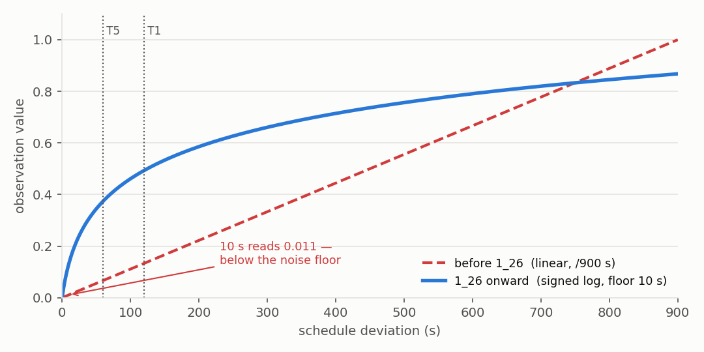

# Observations


!!! abstract "TL;DR"
    A `Dict` observation: per-aircraft scalars, a global vector, relative flight plans, a
    per-aircraft action history, and the two masks. Everything is normalised to `[-1, 1]`.

    Two deliberate choices to know about:

    - **Time features are log-scaled.** Linear encoding put every tier boundary the agent is
      graded on into the bottom 13% of the range and rendered a 10 s error as `0.011`.
    - **The agent sees further than it is charged.** `predicted_infringement` reads a wide
      3–10 NM detection band, while the [conflict penalty](reward.md#conflict-penalty)
      only bites inside 5 NM — so a conflict can be watched developing long before it costs
      anything.


Source: `models/observations.py`, `config/config.py`, `atc_env/single_agent_env.py`

---

## Observation space at a glance

| Key | Type | Shape | Range | Description |
|---|---|---|---|---|
| `global` | Box | `(4,)` | [-1, 1] | Episode-level context |
| `aircraft` | Box | `(10, 12)` | [-1, 1] | Per-aircraft scalar state |
| `mask_aircraft` | MultiBinary | `(10,)` | {0,1} | Valid aircraft slots |
| `mask_action_per_ac` | MultiBinary | `(10, 22)` | {0,1} | Valid clearances per aircraft |
| `flight_plans_rel` | Box | `(10, 20, 11)` | [-1, 1] | Per-aircraft relative waypoint sequences |
| `flight_plan_mask` | MultiBinary | `(10, 20)` | {0,1} | Valid waypoints per aircraft |
| `action_histories` | Box | `(10, 8, 23)` | [0, 1] | Recent actions per aircraft (one-hot) |

Shapes follow: `N_AIRCRAFT_MAX=10`, `AIRCRAFT_SCALAR_LEN=12`, `N_CLEARANCES=22`,
`MAX_WAYPOINTS=20`, `FLIGHT_PLAN_WAYPOINT_DIM=11`, `MAX_HISTORY=8`.

---

## `global` — 4 global features (`models/observations.py:62`)

All four are normalized to **[-1, 1]** via `map_to_sym_unit(v, vmin, vmax)`.

| Index | Field | Raw range | Normalization |
|---|---|---|---|
| 0 | World age (s) | [0, 2880] | `map_to_sym_unit(t, 0, EPISODE_STEPS×TIME_BETWEEN_ACTIONS)` |
| 1 | Active aircraft count | [0, 10] | `map_to_sym_unit(n, 0, N_AIRCRAFT_MAX)` |
| 2 | Mean absolute schedule deviation (s) | [0, 900] | `map_to_sym_unit(dev, 0, TIME_DEVIATION_MAX)` |
| 3 | Max predicted infringement severity | [0, 1] | `map_to_sym_unit(infr, 0, 1)` |

Horizon for time normalization: `64 × 45 = 2880 s`.

---

## `aircraft` — 12 per-aircraft scalar features (`models/observations.py:18`)

`AIRCRAFT_SCALAR_LEN = 12` (`config.py:60`). All values are in `[-1, 1]`.

!!! info "Time features are log-scaled (run 1_26 onward)"
    `time_deviation` and `time_to_target` use a **sign-preserving log** encoding:

    ```
    obs = sign(d) * ln(1 + |d| / FLOOR) / ln(1 + MAX / FLOOR)
    ```

    with `TIME_DEVIATION_LOG_FLOOR_S = 10`, `TIME_DEVIATION_MAX = 1800`. The previous linear
    `clip(d / 900)` crushed every tier boundary the agent is graded on (±60, 70, 100, 120 s)
    into the bottom 13% of the range and encoded a 10 s error as **0.011** — indistinguishable
    from zero after LayerNorm. Measured effect on saturation (fraction of samples pinned at
    ±1): `time_to_target` **65.6% → 18.1%** on MXP and **71.4% → 15.1%** on PMS;
    `time_deviation` clipping 3.2% → 0%. Set `USE_LOG_DEVIATION_OBS = False` for the linear
    encoding as a free ablation.

    Two time features are **not** log-scaled and are known-imperfect: `time_to_conflict` is a
    linear ramp over 20 min while the reward decays exponentially with a 4-minute half-life,
    and `global.time_s` normalises against a 2880 s fallback horizon while real episodes run
    3105–5715 s, so it is pinned at +1 for the last ~23% of every episode.

!!! info "`predicted_infringement` reads the DETECTION band, not severity"
    The observation deliberately sees further than the reward charges: it uses `proximity`
    over the wide 3–10 NM detection band, so a conflict can be watched developing from 10 NM
    even though closing to 6 NM costs nothing.

| Index | Field | Raw unit | Normalization | Notes |
|---|---|---|---|---|
| 0 | `pos_x` | NM | `map_sym(v, 150.0)` | After episode translation matrix |
| 1 | `pos_y` | NM | `map_sym(v, 150.0)` | After episode translation matrix |
| 2 | `pos_z` | ft | `map_sym(v, 45000.0)` | |
| 3 | `vel_xy` | kts | `map_to_sym_unit(v, 0, 350.0)` | Horizontal speed magnitude |
| 4 | `vz` | fpm | `map_sym(v, 3000.0)` | Vertical speed |
| 5 | `heading_sin` | — | raw (from vel vector) | |
| 6 | `heading_cos` | — | raw (from vel vector) | |
| 7 | `time_to_target` | s | `map_to_sym_unit(v, 0, 900)` | Time to arrival target |
| 8 | `time_deviation` | s | `map_sym(v, 900)` | Schedule deviation from rollout |
| 9 | `predicted_infringement` | [0,1] | `map_to_sym_unit(v, 0, 1)` | Max conflict severity in look-ahead |
| 10 | `time_to_conflict` | [0,1] | `_map01_to_sym(v)` | 1=imminent, 0=none/far |
| 11 | `under_control` | {0,1} | raw float | Under ATC control flag |

!!! note
    `time_to_conflict` (`tcf`) is computed as
    `max(0, 1 - ttc / NEAR_CONFLICT_TIME_S)` where `ttc` is the timestamp of the
    earliest predicted loss-of-separation for this aircraft minus the current world
    time (`observations.py:521-524`). `NEAR_CONFLICT_TIME_S = 1200 s` (20 min).

Schedule deviation (`time_deviation`, field 8) comes exclusively from
`MISS_TIMED_LANDING` events in the **NOOP rollout world** (`get_time_deviations`).
`compute_dynamic_deviation` was removed — see `observations.py:412`.

---



The crossover near 750 s is deliberate: resolution is bought where the decision boundaries are
(±60–120 s) and paid for in the tail, where the exact number does not change what the agent
should do.

## `mask_aircraft` and `mask_action_per_ac`

- `mask_aircraft[i]` = 1 if slot `i` contains a live aircraft (under control and
  not completed, or at least not completed if none are under control).
- `mask_action_per_ac[i, j]` = 1 if clearance `j` is geometrically/structurally
  valid for the aircraft in slot `i` (computed by `action_mask.compute_action_mask`).

These two masks are combined in `action_masks()` to produce the flat `bool[220]`
mask consumed by `MaskablePPO`.

---

## `flight_plans_rel` — relative waypoint sequences (`models/observations.py:92`)

Shape `(10, 20, 11)`. Each waypoint vector has `FLIGHT_PLAN_WAYPOINT_DIM = 11`
features, all in `[-1, 1]` (or raw sin/cos/flag):

| Index | Field | Normalization |
|---|---|---|
| 0 | Waypoint global x (NM) | `map_sym(v, 150.0)` |
| 1 | Waypoint global y (NM) | `map_sym(v, 150.0)` |
| 2 | Waypoint global z (ft) | `map_sym(v, 45000.0)` |
| 3 | dx to waypoint (NM) | `map_sym(v, 150.0)` |
| 4 | dy to waypoint (NM) | `map_sym(v, 150.0)` |
| 5 | dz to waypoint (ft) | `map_sym(v, 40000.0)` |
| 6 | Horizontal distance (NM) | `map_to_sym_unit(v, 0, 150.0)` |
| 7 | Bearing sin | raw |
| 8 | Bearing cos | raw |
| 9 | Target speed (kts) | `map_to_sym_unit(v, 0, 350.0)` if available else 0 |
| 10 | Target speed available flag | raw 0/1 |

Coordinates are expressed after the **episode translation matrix** (`T_obs`), a
random uniform translation sampled at `reset()` to avoid positional overfitting
(`single_agent_env.py:275`).

`flight_plan_mask[i, j]` = 1 if waypoint slot `j` is a real waypoint for aircraft `i`.

---

## `action_histories` — recent actions per aircraft

Shape `(10, 8, 23)` = `(N_AIRCRAFT_MAX, MAX_HISTORY, 1 + N_CLEARANCES)`.

Each history step is a vector of length 23:

```
[valid_flag, one_hot_clearance_0, ..., one_hot_clearance_21]
```

- `valid_flag = 1.0` if this slot holds a real past action, `0.0` if padding.
- The one-hot portion encodes the clearance index.
- History is in **reverse chronological order** (most recent first).
- Slots without history are zero-padded.

Values are in `[0, 1]` (hence the Box bounds differ from other keys).

---

## Normalization helpers (`models/observations.py:167`)

| Function | Formula | Output range |
|---|---|---|
| `map_sym(v, half_range)` | `clip(v / half_range, -1, 1)` | [-1, 1] |
| `map_to_sym_unit(v, vmin, vmax)` | `_map01_to_sym(clip((v-vmin)/(vmax-vmin), 0, 1))` | [-1, 1] |
| `_map01_to_sym(x)` | `2 * clip(x, 0, 1) - 1` | [-1, 1] |
| `_normalize(v, vmin, vmax)` | `clip((v-vmin)/(vmax-vmin), 0, 1)` | [0, 1] |
| `_normalize_sym(v, scale)` | `clip(v / scale, -1, 1)` | [-1, 1] |

!!! note
    `under_control` (field 11 of aircraft scalars) and the action history
    `valid_flag` are passed as raw floats without further normalization.
