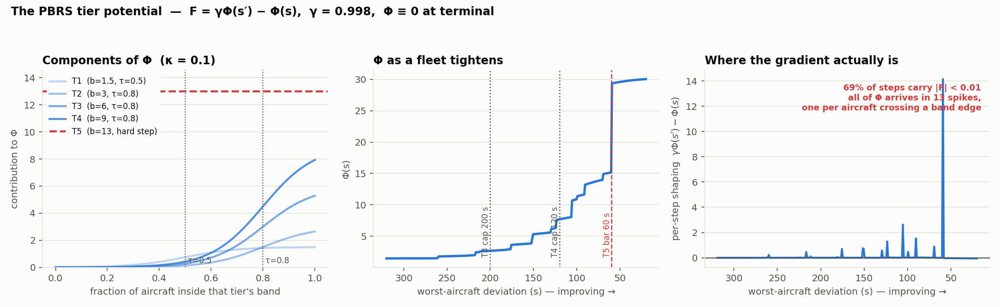

# Reward shaping (PBRS)

!!! abstract "TL;DR"
    The tier ladder is delivered as **potential-based reward shaping** — `F = γΦ(s′) − Φ(s)`
    with `Φ ≡ 0` at terminal — so it cannot change which policy is optimal
    ([Ng, Harada & Russell 1999](#refs)).

    **The potential we ship is a staircase.** Φ depends on the fleet almost entirely through
    *counts* — the fraction of aircraft inside each tier band — and with 10 aircraft a fraction
    moves in steps of 0.1. So the agent is paid **nothing** until one aircraft crosses a band
    edge, then a lump. On a sweep from a 320 s worst aircraft down to 20 s, **most steps carry
    essentially no shaping at all**, and the T5 term is an unsmoothed **13-point cliff**.

    Two fixes are proposed below: make Φ continuous in the deviations themselves, and express
    the **action cost** as *dynamic potential-based advice* over state-action pairs
    ([Wiewiora et al. 2003](#refs); [Devlin & Kudenko 2012](#refs);
    [Harutyunyan et al. 2015](#refs)) so that it stops changing the optimal policy.

Source: `actions/rewards.py::tier_potential`, `atc_env/single_agent_env.py:411-419`,
`config/config.py:452-457`.

---

## The guarantee we are relying on { #theory }

Ng, Harada & Russell (1999) proved that a shaping reward of the form

```
F(s, a, s′) = γ Φ(s′) − Φ(s)
```

leaves the optimal policy of the underlying MDP unchanged — and, crucially, that this form is
**necessary** as well as sufficient: any shaping that is *not* a potential difference can, for
some MDP consistent with the same transition structure, make a suboptimal policy optimal. That
is why the tier ladder is delivered this way and the deviation, conflict and action terms are
not: the ladder is *guidance*, and guidance must not move the goalposts.

Two consequences we depend on:

- **The shaping telescopes.** Over an episode, `Σ_t γ^t F_t = γ^T Φ(s_T) − Φ(s_0)`. With
  `Φ(s_T) = 0` this is just `−Φ(s_0)`, a constant offset per episode that depends only on the
  starting state. The agent cannot farm shaping by cycling.
- **Terminal states must be handled explicitly.** `_check_terminated` sets
  `Φ = 0` on the terminal step (`single_agent_env.py:417`), so the last real transition pays
  `γ·0 − Φ(s_T)`. Grześ (2017) shows this is not a formality: in episodic problems the
  potential *of* the terminal state is used when computing the shaping of its predecessors, and
  Ng's "zero shaping reward at goal states" condition can be satisfied by non-zero potentials
  that still break things. Zero is the safe choice and it is what we do.

---

## What we actually ship { #current }

```
Φ(s) = Σ_{j=1..4}  b_j · σ( (cover_j(s) − τ_j) / κ )        ← T3, T4 additionally × σ((cap_j − max_dev)/κ_max)
     +             b_5 · 1[ every aircraft within ±60 s ]    ← unsmoothed
```

| symbol | meaning | value |
|---|---|---|
| `b_1..b_5` | tier weights, reused from the terminal bonus ladder | 1.5, 3, 6, 9, 13 |
| `cover_j` | **fraction of aircraft** inside tier *j*'s deviation band | multiples of 1/10 |
| `τ_j` | required fraction | 0.5 (T1), 0.8 (T2–T4) |
| `κ` | sigmoid width on the *fraction* axis | `PBRS_KAPPA` = 0.1 |
| `κ_max` | sigmoid width on the worst-aircraft-deviation axis | `PBRS_KAPPA_MAX_DEV` = 30 s |
| `γ` | must equal the PPO discount | `PBRS_GAMMA` = 0.998 |



---

## What the figure shows, and why it is a problem { #diagnosis }

**Left — the components.** Each tier contributes a sigmoid in *coverage*. With κ = 0.1 the
transition is genuinely soft, spanning roughly ±0.2 of coverage. That looks healthy.

**Middle — Φ along a fleet that is steadily tightening.** It is a **staircase**. The reason is
in the table above: `cover_j` is a *fraction of ten aircraft*, so it only ever takes the values
0, 0.1, … 1.0. Smoothing a variable that lives on an 11-point lattice does not make the
potential smooth — the sigmoid is only ever evaluated at those eleven points. Φ therefore
changes when, and only when, an aircraft crosses a band edge.

**Right — what the agent is actually paid per step.** Almost all of Φ arrives in a handful of
spikes. Between them the shaping is ~zero, which is the opposite of what dense shaping is for.

Three specific defects follow:

1. **Quantisation.** The gradient the ladder was supposed to provide does not exist between
   crossings. An action that moves an aircraft from 130 s to 65 s of deviation — enormous
   progress — earns **nothing** unless it happens to cross 120 s or 60 s.
2. **The T5 term is a discontinuity.** `all_under_tier5` is a hard 0/1 indicator multiplied by
   13. Every other rung is smoothed; the most important one is a cliff. A single aircraft
   sitting at 60.1 s holds back the entire 13-point term.
3. **Only `max_dev` is continuous.** The T3/T4 gates are the sole part of Φ that responds
   smoothly to the deviations themselves, and they saturate over κ_max = 30 s. That is a thin
   channel for the one quantity that actually gates success.

!!! note "This is consistent with what the runs do"
    Worst-aircraft deviation is exactly where every run plateaus — `1_26` at 43 s, `1_27a` at
    76 s, against a T5 bar of 60 s. A potential that is flat between band crossings is a
    plausible contributor: the agent gets no signal for the last few seconds of tightening,
    which is precisely the regime that decides T5.

---

## Fix 1 — make Φ continuous in the deviations { #fix-continuous }

Replace the count with a **soft membership**. Instead of

```
cover_j = (1/N) · Σ_i  1[ |dev_i| ≤ d_j ]
```

use

```
cover_j = (1/N) · Σ_i  σ( (d_j − |dev_i|) / κ_dev )
```

Now every aircraft contributes a value that moves continuously as its own deviation changes, so
Φ responds to *any* improvement rather than only to boundary crossings. The same substitution
smooths T5, removing the 13-point cliff.

This is still a function of state alone, so **policy invariance is untouched** — it is a
different Φ, not a different shaping form. `κ_dev` becomes the one new constant; it should be
set from the deviation scale (order 10–20 s), not from the fraction scale.

!!! warning "Check the telescoping before and after"
    Φ(s₀) changes, so the per-episode constant offset `−Φ(s₀)` changes with it. That is
    harmless for the optimal policy but it shifts episode returns, which the violation penalty
    is calibrated against — see [reward](reward.md). Re-read `return_clean_min/max` after any
    change to Φ.

---

## Fix 2 — the action cost as dynamic potential-based advice { #fix-advice }

**The problem.** The action cost is a plain reward term:

```
r_action = −(n_commands)^1.25 · 0.02 · dof,     dof = 1 + 3·(20 − remaining_wp)/20
```

It is *not* potential-based, so by Ng's necessity result it **can and does change which policy
is optimal**. We are not merely discouraging chatter; we are optimising a different problem from
the one we mean to. That is a real cost, and it is why the "action cost waived under urgency"
idea on the [roadmap](roadmap.md) is delicate — any reshaping of a non-potential term is
another change to the objective.

**The fix has a name.** Three results compose:

- **Wiewiora, Cottrell & Elkan (2003)** extend potentials to *state-action* pairs — *advice*.
  Look-ahead advice is `F(s,a,s′,a′) = γΦ(s′,a′) − Φ(s,a)`. Because Φ now depends on the
  action, the guarantee comes with a condition: the greedy policy must be taken with respect to
  `Q(s,a) + Φ₀(s,a)`, not `Q` alone.
- **Devlin & Kudenko (2012)** show the guarantee survives making Φ **time-varying**, `Φ(s,t)`,
  which is what lets the potential be *learned* rather than hand-specified.
- **Harutyunyan, Devlin, Vrancx & Nowé (2015)** put the two together: to deliver an arbitrary
  reward `R†` as advice, learn a **secondary state-action value function** on the *negation* of
  `R†`,

  ```
  Φ(s,a) ← −R†(s,a) + γ Φ(s′,a′)
  ```

  and use its running estimates as the dynamic advice potential. The resulting shaping then
  satisfies `F = γΦ(s′,a′) − Φ(s,a) ≈ R†(s,a)` **in expectation**, while remaining grounded in
  potentials — so the behavioural pressure of `R†` is applied without changing what is optimal.

**Applied here**, `R†` is the action cost. We would:

1. Add a small `Φ`-head on the **existing encoder** — the observation already carries
   `action_histories` (last 8 clearances per aircraft, one-hot), so a state-action potential is
   well-posed with no new inputs. The encoder already produces per-aircraft embeddings and the
   clearance head already emits a value per (aircraft, clearance) pair, which is exactly the
   shape `Φ(s,a)` needs.
2. Train it on `−r_action` with the same γ, as an auxiliary head with its own loss.
3. Apply `F = γΦ(s′,a′) − Φ(s,a)` and **remove `r_action` from the reward total**.
4. Act greedily on `Q + Φ₀`. Initialising the head's output layer to zero makes `Φ₀ ≡ 0`, and
   the biased-greedy rule then collapses to ordinary greedy action selection — which is what we
   already do. Harutyunyan et al. note this explicitly.

!!! danger "What to watch"
    This is the most invasive of the proposals and it has a genuine failure mode: the advice
    potential is only *approximately* `R†` in expectation, and it is being learned concurrently
    with the policy, so early in training it delivers noise. It should be tested against the
    plain-cost baseline on the same 100-seed pool before adoption, and the
    [attempts-to-solution](analysis_methods.md#attempts) probe is the right instrument — the
    hypothesis is that removing a policy-distorting cost should raise the pass@k asymptote, not
    just the mean.

!!! note "It also gives `SHORTEN_TROMBONE` a mechanism"
    The [measured problem](analysis_v1_v2.md#shorten-verdict) with the reduced clearance set is
    that lengthening pays immediately through the conflict term while shortening pays only at
    landing, so the corrective action is never discovered. Advice is defined over
    *(state, action)*, so it can express "this action is worth taking here" in a way a
    state-only potential structurally cannot. That makes it the natural place to encode a
    preference for reversibility — still without changing the optimum.

---

## References { #refs }

1. **Ng, A. Y., Harada, D. & Russell, S. (1999).** *Policy invariance under reward
   transformations: theory and application to reward shaping.* ICML.
   — establishes `F = γΦ(s′) − Φ(s)` as necessary and sufficient for policy invariance.
2. **Wiewiora, E., Cottrell, G. & Elkan, C. (2003).** *Principled methods for advising
   reinforcement learning agents.* ICML.
   — extends potentials to state-action *advice*; introduces look-ahead and look-back advice
   and the biased greedy action-selection requirement.
3. **Devlin, S. & Kudenko, D. (2012).** *Dynamic potential-based reward shaping.* AAMAS,
   pp. 433–440. — the invariance guarantee survives a time-varying potential.
4. **Harutyunyan, A., Devlin, S., Vrancx, P. & Nowé, A. (2015).** *Expressing arbitrary reward
   functions as potential-based advice.* AAAI-29.
   — learn a secondary value function on `−R†` and use its estimates as a dynamic advice
   potential; the shaping then reflects `R†` in expectation.
5. **Grześ, M. (2017).** *Reward shaping in episodic reinforcement learning.* AAMAS,
   pp. 565–573. — the potential of terminal states matters in episodic problems; zero is the
   safe choice.
