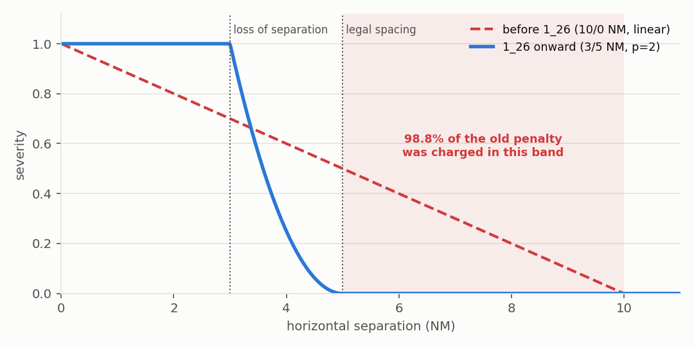

# Reward Function


!!! abstract "TL;DR"
    Five per-step components — deviation, conflict, action cost, a dense goal bonus, and PBRS
    tier shaping — plus a terminal signal. The two that matter most:

    - **Conflict** is `−10 × severity × 2^(−ttc/240 s)`. Severity is **1.0 inside 3 NM and
      500 ft, zero beyond 5 NM**, so legal spacing is free. Before run 1_26 the band ran to
      10 NM and 98.8% of the penalty was charged to pairs that never came within 5 NM.
    - **Deviation** is landing-weighted: the same error costs more the closer an aircraft is
      to touchdown.

    A realised bust pays `−(30 + 0.5 × remaining_steps)` and ends the episode. The forfeit term
    is what stops bailing out early from being profitable.

    See [Observations](observations.md) for what the agent can *see* of all this — deliberately
    a wider band than what it is charged for.


Source: `actions/rewards.py`, `utils/reward_utils.py`, `config/config.py`

---

## `RewardParts` dataclass (`utils/reward_utils.py:8`)

```python
@dataclass
class RewardParts:
    deviation: float   # deviation improvement (negative = worse)
    conflict:  float   # conflict penalty (non-positive)
    action:    float   # per-command cost (non-positive)
    bonus:     float = 0.0  # terminal bonus (set in step(), not calculate_reward)

    def total(self) -> float:
        return deviation + conflict + action + bonus
```

`total()` is what SB3 receives as the scalar step reward.

---

## Component 1 — Deviation reward (`rewards.py:163`)

Uses **`MISS_TIMED_LANDING` events from a deterministic NOOP rollout**
(`current_predicted_world`). `compute_dynamic_deviation` was removed;
deviation is always sourced from the simulator rollout.

```
deviation_reward = -sum_aircraft( weight(ttl) * |dev| ) / REWARD_SCALE_DEVIATION
```

Where:

```
prox    = 1 - min(1, ttl / horizon)     # 0 = far from landing, 1 = imminent
weight  = REWARD_DEVIATION_LANDING_BASELINE + (1 - REWARD_DEVIATION_LANDING_BASELINE) * prox
horizon = EPISODE_STEPS * TIME_BETWEEN_ACTIONS = 128 * 22 = 2816 s
```

Each aircraft's absolute deviation is weighted **linearly by landing proximity**:
from `REWARD_DEVIATION_LANDING_BASELINE = 0.2` (far) up to `1.0` (landing imminent).

---

## Component 2 — Conflict penalty (`rewards.py:28`) { #conflict-penalty }

**Exponentially discounted** over unique predicted aircraft pairs.
For each unique pair, only the **earliest** predicted loss-of-separation is used.

```
w(ttc) = max(CONFLICT_FAR_FLOOR, 2 ^ (-ttc / CONFLICT_HALF_LIFE_S))

conflict_penalty = -REWARD_INFRINGEMENT_WEIGHT * sum_pairs( severity * w(ttc) )
```

- `severity` — see below. Zero beyond 5 NM, so legal spacing costs nothing.
- `ttc` = predicted time to conflict (s), relative to current world time.
- `CONFLICT_HALF_LIFE_S = 240`. This replaced a cubic ramp whose *effective* half-life was
  248 s — nobody chose that, it fell out of the exponent — so the two agree to within 0.02
  everywhere inside 5 minutes, where essentially all the penalty mass sits. What changed is
  the far field: the cubic collapsed to the floor by 20 min (weight 0.016 at 15 min) while
  the exponential keeps a real gradient there (0.074).

### Severity geometry (run 1_26 onward)



Two deliberately different radius pairs. Detection is wide so the agent can *see* a conflict
develop (that side is covered in [Observations](observations.md)); severity is narrow so it is
only *charged* for closeness that matters.

```
u        = clamp( min( (5 - h)/(5 - 3), (1000 - v)/(1000 - 500) ), 0, 1 )
severity = u ^ SEVERITY_SHAPE_P          # p = 2, convex

  severity = 1.0  <=>  h <= 3 NM AND v <= 500 ft    (the operational loss of separation)
  severity = 0.0  <=   h >= 5 NM  or  v >= 1000 ft  (legal spacing — free)
```

Before this, the band was 10/0 NM: severity 1.0 required literally zero separation and was
unreachable, and **98.8% of the conflict penalty was charged to pairs that never came within
5 NM** — a continuous tax on the arrival spacing that hitting AMAN times requires.

The convex `p = 2` decay puts the strongest restoring gradient immediately outside 3 NM
(0.95/NM against 0.50 for a linear ramp) and meets zero at 5 NM with matching slope, so there
is no kink at legal spacing. The corner sits at 3 NM, which is where a hard edge belongs — the
episode ends there.

`LOS_SEVERITY_THRESHOLD = 1.0` is the single failure definition: it drives the tier gate,
`end_reason="separation"` and episode termination. `NEAR_CONFLICT_DISTANCE_NM = 3.5` is a
diagnostic/eval-shield threshold only, pinned as a **distance** because a severity threshold
silently changes meaning whenever the band edges or `SEVERITY_SHAPE_P` move.

---

## Component 3 — Action penalty (`rewards.py`)

```python
action_reward = -(num_commands ** 1.25) * REWARD_ACTION_PENALTY_WEIGHT * dof_factor
```

`num_commands = len(interpreted_actions.commands)`. The 1.25 exponent applies a
slightly super-linear cost to issuing many commands in one step.

### Degrees-of-freedom (DOF) scaling

Acting late — when the commanded aircraft has few remaining waypoints — is penalised more
than acting early. The factor scales the base action cost:

```
factor = max(1.0,  1 + K × (W − r) / W)
```

where `r` = remaining waypoints at decision time, `W = MAX_WAYPOINTS`, `K = REWARD_ACTION_DOF_K`.

| `K` | `W` | `r = W` (act early) | `r = W/2` | `r = 1` (act very late) |
|---|---|---|---|---|
| 3.0 | 20 | 1.0× | 2.5× | 3.85× |

`K = 0` disables DOF scaling (flat cost, back-compat). `remaining_wps = None` also returns factor 1.0.

---

## 🎯 Terminal success-tier ladder (set in `step()`)

The terminal bonus is the policy's **primary north star**, and it is **graduated across five
escalating tiers** rather than an all-or-nothing "solved" flag. The highest tier reached wins —
**tiers do not stack** — and each higher tier strictly implies all lower ones, so the agent
always sees a gradient toward the next rung:

```
            tighter schedule  +  worst aircraft pulled in  ───────────────►

   T1   ──►   T2   ──►   T3   ──►   T4   ──►   T5
  +1.5      +3.0      +6.0      +9.0     +13.0     bonus
  ≥50%      ≥80%      ≥80%      ≥80%      ALL      fraction of aircraft
 ±120 s    ±100 s     ±70 s     ±60 s    ±60 s     within deviation
   —         —      max<200 s max<120 s  all       extra worst-aircraft /
                                        landed      completion gate
```

Every tier *additionally* requires the **relaxed near-conflict gate**: predicted conflicts must
be clear for the final `SUCCESS_NEAR_CONFLICT_CLEAR_STEPS = 6` steps (≈ 132 s before landing) —
not the old unsatisfiable "no near-conflict ever".

| Tier | Criterion | `bonus` | What it targets |
|---|---|---|---|
| **Hard violation** | loss of separation or airspace exit | **−15.0** (`REWARD_VIOLATION_PENALTY`); **suppresses any tier bonus** | safety floor |
| **Tier 1** | ≥ 50% of aircraft within ±120 s | **+1.5** | low bar; gradient from the first steps |
| **Tier 2** | ≥ 80% within ±100 s | **+3.0** | majority on schedule |
| **Tier 3** | ≥ 80% within ±70 s **and** `max_dev` < 200 s | **+6.0** | tail aircraft starts closing |
| **Tier 4** | ≥ 80% within ±60 s **and** `max_dev` < 120 s | **+9.0** | near-solved |
| **Tier 5** | all landed **and** all within ±60 s | **+13.0** | **solved** |
| No tier reached | — | 0.0 | — |

**Why a ladder?** Runs 1–7 used a single all-or-nothing ±30 s gate that *never* fired
(`success_rate = 0`), so the terminal signal was flat and uninformative. The tiers supply dense
terminal gradient, and the explicit `max_aircraft_dev` caps at **Tiers 3–4** specifically pull in
the **worst-case aircraft** — the binding constraint that floored the deviation ceiling at
~360–390 s across those runs. Introducing the ladder (Run 8) lifted success from **0% → ~30%**.

The violation penalty (15.0) is set **above** the maximum tier bonus (13.0) so a hard violation
always produces a worse outcome than any tier, even T5.

The bonus is applied to `last_reward.bonus` **after** `calculate_reward` returns,
so `r_parts.total()` is recomputed with it before being passed to SB3.

!!! note "Replaces `REWARD_SUCCESS_BONUS`"
    The old flat ±5.0 `REWARD_SUCCESS_BONUS` is deprecated and unused. `REWARD_VIOLATION_PENALTY`
    is now independently tunable from the tier bonuses.

---

## Reward config reference

| Constant | Value | Role |
|---|---|---|
| `REWARD_SCALE_DEVIATION` | 2000 | Divides raw weighted deviation sum |
| `REWARD_DEVIATION_LANDING_BASELINE` | 0.2 | Weight at far-from-landing end |
| `REWARD_INFRINGEMENT_WEIGHT` | 10.0 | Conflict penalty scale |
| `NEAR_CONFLICT_TIME_S` | 1200.0 s | Ramp gate (20 min) |
| `CONFLICT_TIME_EXPONENT` | 3.0 | Ramp steepness (p in formula) |
| `CONFLICT_FAR_FLOOR` | 0.005 | Residual cost beyond T_near |
| `NEAR_CONFLICT_SEVERITY_THRESHOLD` | 0.7 | Severity gate for success check |
| `REWARD_ACTION_PENALTY_WEIGHT` | 0.02 | Per-command cost weight |
| `REWARD_ACTION_DOF_K` | 3.0 | DOF scaling factor K; 0 = flat cost |
| `REWARD_VIOLATION_PENALTY` | 15.0 | Terminal penalty for hard violations (> T5 bonus) |
| `REWARD_SUCCESS_BONUS_TIER1` | 1.5 | Terminal bonus — tier 1 |
| `REWARD_SUCCESS_BONUS_TIER2` | 3.0 | Terminal bonus — tier 2 |
| `REWARD_SUCCESS_BONUS_TIER3` | 6.0 | Terminal bonus — tier 3 |
| `REWARD_SUCCESS_BONUS_TIER4` | 9.0 | Terminal bonus — tier 4 |
| `REWARD_SUCCESS_BONUS_TIER5` | 13.0 | Terminal bonus — tier 5 ("solved") |
| `SUCCESS_TIER1_DEV_S` | 120.0 s | Deviation threshold for tier 1 |
| `SUCCESS_TIER1_FRAC` | 0.5 | Fraction of aircraft required for tier 1 |
| `SUCCESS_TIER2_DEV_S` | 100.0 s | Deviation threshold for tier 2 |
| `SUCCESS_TIER2_FRAC` | 0.8 | Fraction required for tiers 2–4 |
| `SUCCESS_TIER3_DEV_S` | 70.0 s | Deviation threshold for tier 3 |
| `SUCCESS_TIER3_MAX_DEV_S` | 200.0 s | `max_aircraft_dev` cap for tier 3 |
| `SUCCESS_TIER4_DEV_S` | 60.0 s | Deviation threshold for tier 4 |
| `SUCCESS_TIER4_MAX_DEV_S` | 120.0 s | `max_aircraft_dev` cap for tier 4 |
| `SUCCESS_TIER5_DEV_S` | 60.0 s | Deviation threshold for tier 5 (all aircraft) |
| `SUCCESS_NEAR_CONFLICT_CLEAR_STEPS` | 6 | Conflicts must be clear for this many final steps (≈ 132 s) |
| `REWARD_GOAL_BONUS_SCALE_MAX` | 200.0 s | `max_aircraft_dev` sensitivity in goal bonus |
| `REWARD_INFRINGEMENT_DECAY_TAU` | 2000.0 | **Legacy; unused** by the current ramp |
| `USE_ROLLOUT_DEVIATION` | `True` | Always use NOOP rollout deviation |
| `REWARD_SUCCESS_BONUS` | 5.0 | **Deprecated / unused** — replaced by graduated tiers |

!!! note
    `REWARD_INFRINGEMENT_DECAY_TAU` appears in config but is not used by the
    current `infringement_reward_from_world` implementation. The `time_decay_tau`
    parameter is accepted for signature compatibility but ignored.

---

## Full reward flow

```
step(action)
  -> apply_action_and_advance()                    # advance 22 s (TIME_BETWEEN_ACTIONS)
  -> advance_multiple_steps(max_steps_per_episode) # NOOP rollout -> current_predicted_world
  -> calculate_reward(...)
       deviation  = _deviation_reward_rollout(predicted_world, t)
       conflict   = infringement_reward_from_world(predicted_world, t)
       action     = -_action_penalty(interpreted_actions)   # DOF-scaled
       goal       = _goal_bonus(predicted_world)            # exp(-total_dev/S_T) * exp(-max_dev/S_M)
       -> RewardParts(deviation, conflict, action, goal)
  -> _check_terminated / _check_truncated
  -> adjust bonus on terminal step
  -> reward = r_parts.total()
```
